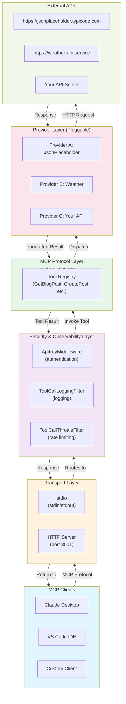
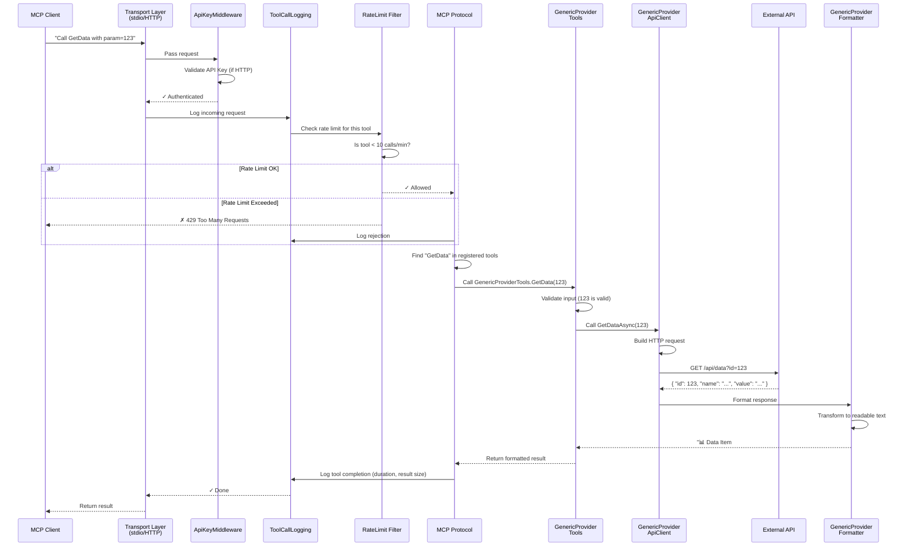
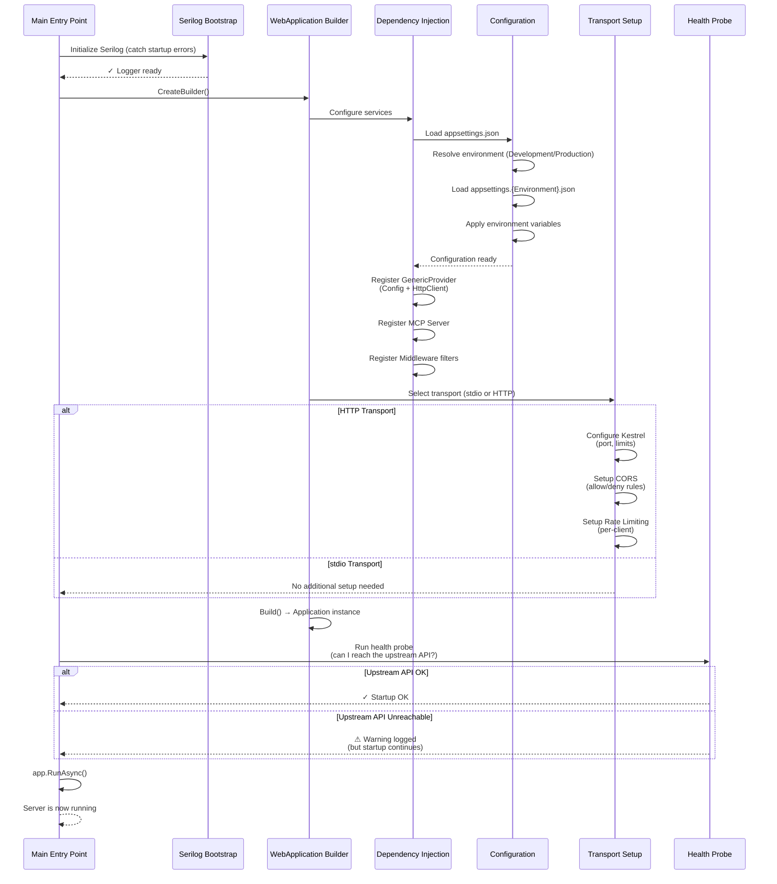
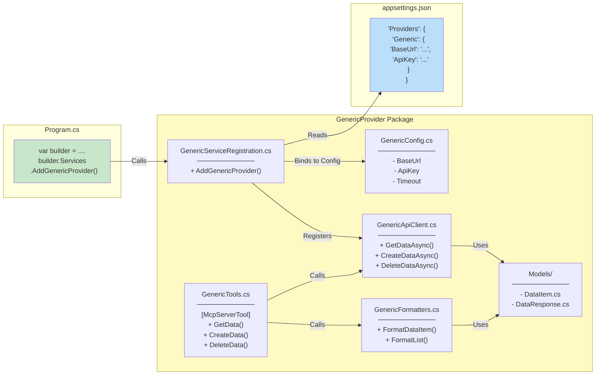
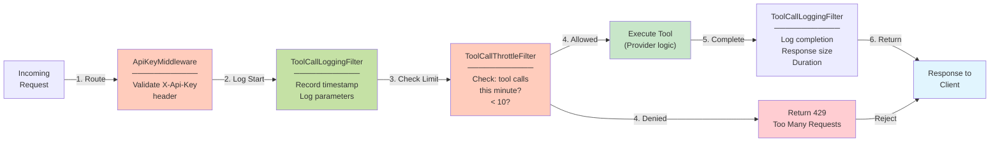
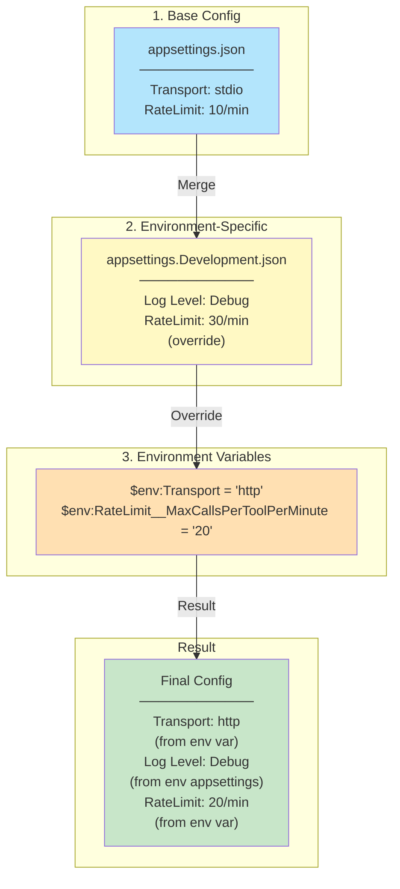
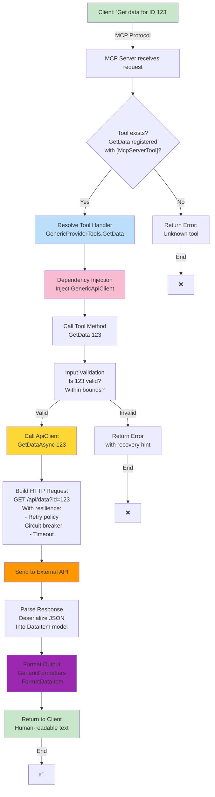
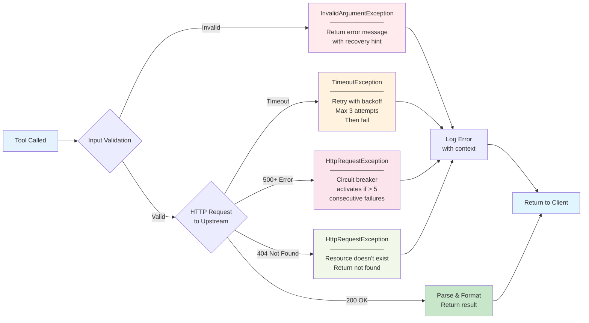
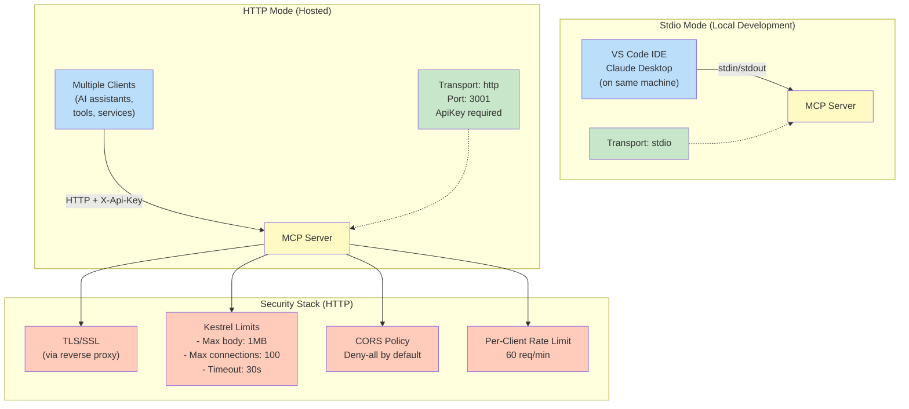
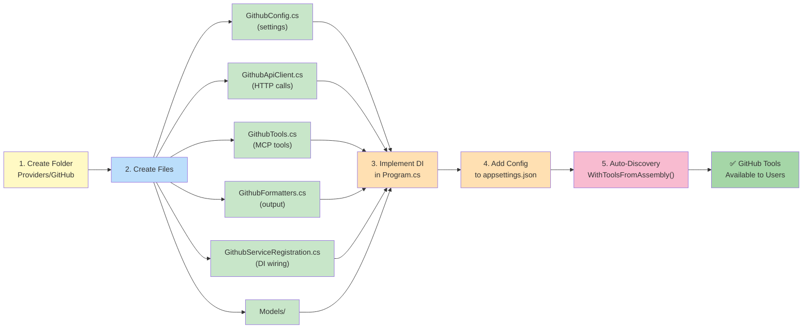

# Architecture Flowcharts

This document contains flowcharts describing the MCP server structure and request flow, using a generic provider as an example.

## 1. High-Level System Architecture

---

## 2. Request Lifecycle: Complete Flow

---

## 3. Startup Initialization Sequence

---

## 4. Provider Structure & Relationships

---

## 5. Middleware & Filter Chain

---

## 6. Configuration Flow: Precedence & Merging

---

## 7. Tool Invocation: What Happens Behind the Scenes

---

## 8. Error Handling Flow

---

## 9. Deployment: stdio vs HTTP

---

## 10. Adding a New Provider: Step-by-Step

