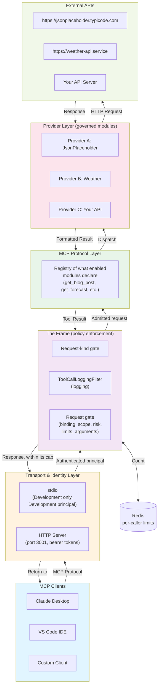
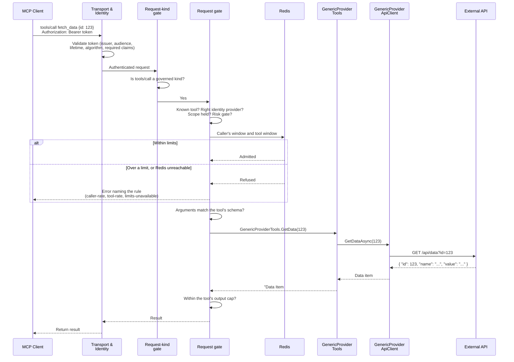
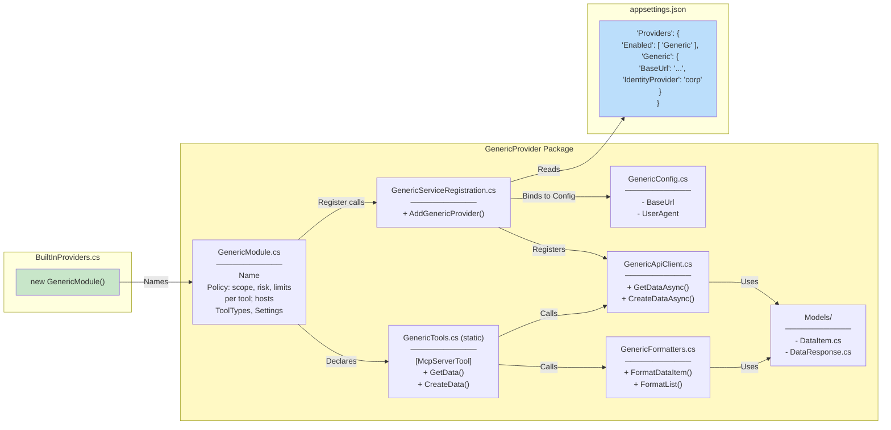
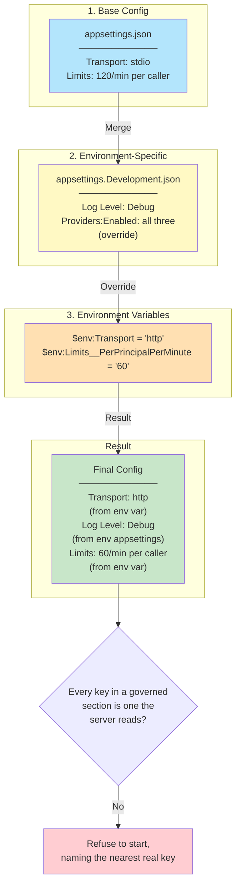
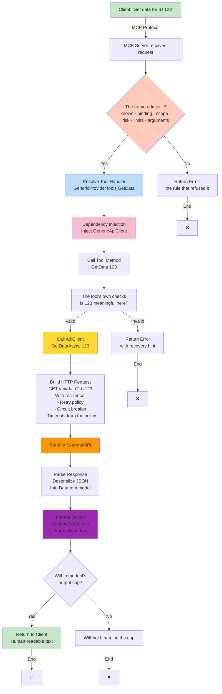
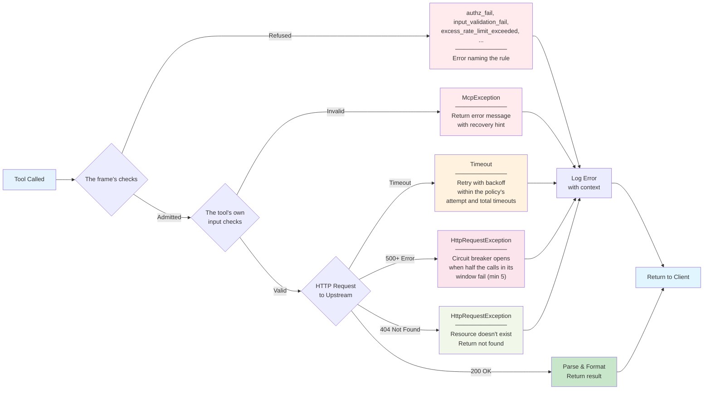
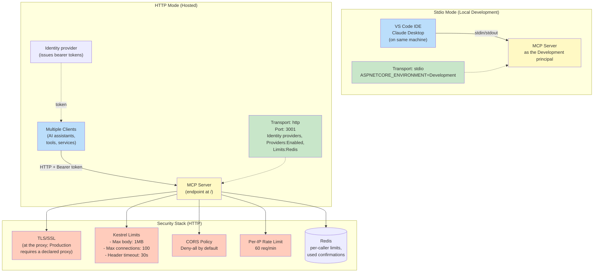
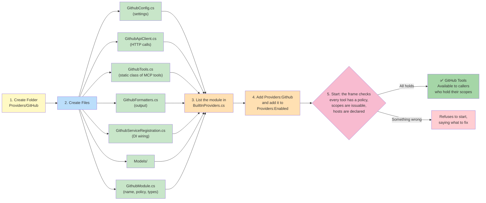

# Architecture Flowcharts

This document contains flowcharts describing the MCP server structure and request flow, using a generic provider as an example. For the security design in depth — trust boundaries, every refusal, the planned egress guard, strikes and revocation — see [07-SECURITY-FLOWCHARTS.md](07-SECURITY-FLOWCHARTS.md).

## 1. High-Level System Architecture

```mermaid
graph TB
    subgraph Client["MCP Clients"]
        A1["Claude Desktop"]
        A2["VS Code IDE"]
        A3["Custom Client"]
    end

    subgraph Transport["Transport & Identity Layer"]
        T1["stdio<br/>(Development only,<br/>Development principal)"]
        T2["HTTP Server<br/>(port 3001, bearer tokens)"]
    end

    subgraph Frame["The Frame (policy enforcement)"]
        F1["Request-kind gate"]
        F2["ToolCallLoggingFilter<br/>(logging)"]
        F3["Request gate<br/>(binding, scope, risk,<br/>limits, arguments)"]
    end

    subgraph MCP["MCP Protocol Layer"]
        MP["Registry of what enabled<br/>modules declare<br/>(get_blog_post, get_forecast, etc.)"]
    end

    subgraph Providers["Provider Layer (governed modules)"]
        P1["Provider A: JsonPlaceholder"]
        P2["Provider B: Weather"]
        P3["Provider C: Your API"]
    end

    subgraph External["External APIs"]
        E1["https://jsonplaceholder.typicode.com"]
        E2["https://weather-api.service"]
        E3["Your API Server"]
    end

    Redis[("Redis<br/>per-caller limits")]

    Client -->|MCP Protocol| Transport
    Transport -->|Authenticated principal| Frame
    Frame -->|Admitted request| MCP
    Frame <-->|Count| Redis
    MCP -->|Dispatch| Providers
    Providers -->|HTTP Request| External
    External -->|Response| Providers
    Providers -->|Formatted Result| MCP
    MCP -->|Tool Result| Frame
    Frame -->|Response, within its cap| Transport
    Transport -->|Return to| Client

    style Client fill:#e1f5ff
    style Transport fill:#fff3e0
    style Frame fill:#f3e5f5
    style MCP fill:#e8f5e9
    style Providers fill:#fce4ec
    style External fill:#f1f8e9
```

---

## 2. Request Lifecycle: Complete Flow

```mermaid
sequenceDiagram
    participant Client as MCP Client
    participant Transport as Transport &<br/>Identity
    participant Kinds as Request-kind<br/>gate
    participant Gate as Request gate
    participant Redis as Redis
    participant Tool as GenericProvider<br/>Tools
    participant ApiClient as GenericProvider<br/>ApiClient
    participant API as External API

    Client->>Transport: tools/call fetch_data {id: 123}<br/>Authorization: Bearer token
    Transport->>Transport: Validate token (issuer, audience,<br/>lifetime, algorithm, required claims)
    Transport->>Kinds: Authenticated request
    Kinds->>Kinds: Is tools/call a governed kind?
    Kinds->>Gate: Yes
    Gate->>Gate: Known tool? Right identity provider?<br/>Scope held? Risk gate?
    Gate->>Redis: Caller's window and tool window
    alt Within limits
        Redis-->>Gate: Admitted
    else Over a limit, or Redis unreachable
        Redis-->>Gate: Refused
        Gate-->>Client: Error naming the rule<br/>(caller-rate, tool-rate, limits-unavailable)
    end
    Gate->>Gate: Arguments match the tool's schema?
    Gate->>Tool: GenericProviderTools.GetData(123)
    Tool->>ApiClient: GetDataAsync(123)
    ApiClient->>API: GET /api/data?id=123
    API-->>ApiClient: { "id": 123, "name": "...", "value": "..." }
    ApiClient-->>Tool: Data item
    Tool-->>Gate: "Data Item #123 ..." (formatted)
    Gate->>Gate: Within the tool's output cap?
    Gate-->>Transport: Result
    Transport-->>Client: Return result
```

---

## 3. Startup Initialization Sequence

```mermaid
sequenceDiagram
    participant Main as Main Entry Point
    participant Logger as Serilog Bootstrap
    participant Config as Configuration
    participant Frame as The Frame
    participant Modules as Provider Modules
    participant Transport as Transport Setup

    Main->>Logger: Initialize Serilog (catch startup errors)
    Main->>Config: Load appsettings.json, appsettings.{Environment}.json,<br/>environment variables, command line
    Main->>Transport: Select transport (stdio: Development only)
    alt HTTP Transport
        Transport->>Transport: Validate identity providers and resource URI
    end
    Main->>Frame: Compose the governed MCP server
    Frame->>Frame: Every governed setting known? Enabled providers exist?
    Frame->>Modules: Each enabled module registers its services — watched
    Modules-->>Frame: Nothing removed, nothing of the frame's added
    Frame->>Frame: Register the frame last: limits (Redis or, in Development, memory),<br/>confirmation key, request gate, MCP server with the modules' types
    alt HTTP Transport
        Transport->>Transport: Kestrel limits, forwarded headers, host allowlist,<br/>CORS, per-IP rate limiting, identity schemes
    end
    Main->>Frame: Validate at startup
    Frame->>Frame: Installed checks are the frame's; every primitive has a policy;<br/>every policy names something served; scopes issuable; hosts exact
    alt Anything wrong
        Frame-->>Main: ConfigurationException → exit 78, naming what to fix
    else All holds
        Frame-->>Main: Log the installed frame and policies
        Main->>Main: app.RunAsync()
    end
```

---

## 4. Provider Structure & Relationships

```mermaid
graph LR
    subgraph GenericProvider["GenericProvider Package"]
        Module["GenericModule.cs<br/>────────────<br/>Name<br/>Policy: scope, risk, limits<br/>per tool; hosts<br/>ToolTypes, Settings"]

        Config["GenericConfig.cs<br/>────────────<br/>- BaseUrl<br/>- UserAgent"]

        ApiClient["GenericApiClient.cs<br/>────────────<br/>+ GetDataAsync()<br/>+ CreateDataAsync()"]

        Tools["GenericTools.cs (static)<br/>────────────<br/>[McpServerTool]<br/>+ GetData()<br/>+ CreateData()"]

        Models["Models/<br/>────────────<br/>- DataItem.cs<br/>- DataResponse.cs"]

        Formatters["GenericFormatters.cs<br/>────────────<br/>+ FormatDataItem()<br/>+ FormatList()"]

        DI["GenericServiceRegistration.cs<br/>────────────<br/>+ AddGenericProvider()"]
    end

    subgraph "BuiltInProviders.cs"
        List["new GenericModule()"]
    end

    subgraph "appsettings.json"
        AppSettings["'Providers': {<br/>&nbsp;&nbsp;'Enabled': [ 'Generic' ],<br/>&nbsp;&nbsp;'Generic': {<br/>&nbsp;&nbsp;&nbsp;&nbsp;'BaseUrl': '...',<br/>&nbsp;&nbsp;&nbsp;&nbsp;'IdentityProvider': 'corp'<br/>&nbsp;&nbsp;}<br/>}"]
    end

    List -->|Names| Module
    Module -->|Register calls| DI
    Module -->|Declares| Tools
    DI -->|Reads| AppSettings
    DI -->|Binds to Config| Config
    DI -->|Registers| ApiClient
    ApiClient -->|Uses| Models
    Tools -->|Calls| ApiClient
    Tools -->|Calls| Formatters
    Formatters -->|Uses| Models

    style GenericProvider fill:#fff9c4
    style List fill:#c8e6c9
    style AppSettings fill:#bbdefb
```

---

## 5. Middleware & Filter Chain

```mermaid
graph LR
    Request["Incoming<br/>HTTP Request"] -->|1| Pipeline["Forwarded headers → HSTS →<br/>host allowlist → CORS →<br/>per-IP limit → origin guard"]

    Pipeline -->|2| Auth["Authentication<br/>────────────<br/>Bearer token from a<br/>configured identity provider"]

    Auth -->|3| Kinds["Request-kind gate<br/>────────────<br/>Only governed kinds"]

    Kinds -->|4| Logger["ToolCallLoggingFilter<br/>────────────<br/>Correlation ID, timing"]

    Logger -->|5| Gate["Request gate<br/>────────────<br/>binding · scope · risk ·<br/>limits · arguments"]

    Gate -->|6. Admitted| Execute["Execute Tool<br/>(Provider logic)"]
    Gate -->|6. Refused| Refused["Error naming the rule<br/>+ security event logged"]

    Execute -->|7| Cap["Output cap<br/>────────────<br/>Withhold an oversized answer"]

    Cap -->|8| Response["Response to<br/>Client"]

    Refused --> Response

    style Auth fill:#ffccbc
    style Kinds fill:#ffccbc
    style Logger fill:#c5e1a5
    style Gate fill:#ffccbc
    style Execute fill:#c8e6c9
    style Refused fill:#ffcdd2
    style Response fill:#e1f5fe
```

---

## 6. Configuration Flow: Precedence & Merging

```mermaid
graph TB
    subgraph "1. Base Config"
        Base["appsettings.json<br/>────────────<br/>Transport: stdio<br/>Limits: 120/min per caller"]
    end

    subgraph "2. Environment-Specific"
        Env["appsettings.Development.json<br/>────────────<br/>Log Level: Debug<br/>Providers:Enabled: all three<br/>(override)"]
    end

    subgraph "3. Environment Variables"
        EnvVars["$env:Transport = 'http'<br/>$env:Limits__PerPrincipalPerMinute = '60'"]
    end

    subgraph "Result"
        Final["Final Config<br/>────────────<br/>Transport: http<br/>(from env var)<br/>Log Level: Debug<br/>(from env appsettings)<br/>Limits: 60/min per caller<br/>(from env var)"]
    end

    Check{"Every key in a governed<br/>section is one the<br/>server reads?"}

    Base -->|Merge| Env
    Env -->|Override| EnvVars
    EnvVars -->|Result| Final
    Final --> Check
    Check -->|No| Stop["Refuse to start,<br/>naming the nearest real key"]

    style Base fill:#b3e5fc
    style Env fill:#fff9c4
    style EnvVars fill:#ffe0b2
    style Final fill:#c8e6c9
    style Stop fill:#ffcdd2
```

---

## 7. Tool Invocation: What Happens Behind the Scenes

```mermaid
graph TD
    A["Client: 'Get data for ID 123'"] -->|MCP Protocol| B["MCP Server receives request"]

    B --> C{"The frame admits it?<br/>known · binding · scope ·<br/>risk · limits · arguments"}

    C -->|Yes| D["Resolve Tool Handler<br/>GenericProviderTools.GetData"]

    C -->|No| E["Return Error:<br/>the rule that refused it"]

    D --> F["Dependency Injection<br/>Inject GenericApiClient"]

    F --> G["Call Tool Method<br/>GetData 123"]

    G --> H["The tool's own checks<br/>Is 123 meaningful here?"]

    H -->|Invalid| I["Return Error<br/>with recovery hint"]

    H -->|Valid| J["Call ApiClient<br/>GetDataAsync 123"]

    J --> K["Build HTTP Request<br/>GET /api/data?id=123<br/>With resilience:<br/>- Retry policy<br/>- Circuit breaker<br/>- Timeouts from the policy"]

    K --> L["Send to External API"]

    L --> M["Parse Response<br/>Deserialize JSON<br/>Into DataItem model"]

    M --> N["Format Output<br/>GenericFormatters<br/>.FormatDataItem"]

    N --> P{"Within the tool's<br/>output cap?"}

    P -->|Yes| O["Return to Client<br/>Human-readable text"]
    P -->|No| Q["Withhold, naming the cap"]

    E -->|End| Z1["❌"]
    I -->|End| Z2["❌"]
    Q -->|End| Z4["❌"]
    O -->|End| Z3["✅"]

    style A fill:#c8e6c9
    style C fill:#ffccbc
    style D fill:#bbdefb
    style F fill:#f8bbd0
    style J fill:#fdd835
    style L fill:#ff9800
    style N fill:#9c27b0
    style O fill:#c8e6c9
```

---

## 8. Error Handling Flow

```mermaid
graph LR
    Start["Tool Called"] --> Frame{"The frame's checks"}

    Frame -->|Refused| E0["authz_fail, input_validation_fail,<br/>excess_rate_limit_exceeded, ...<br/>────────────<br/>Error naming the rule"]

    Frame -->|Admitted| Input{"The tool's own<br/>input checks"}

    Input -->|Invalid| E1["McpException<br/>────────────<br/>Return error message<br/>with recovery hint"]

    Input -->|Valid| ApiCall{"HTTP Request<br/>to Upstream"}

    ApiCall -->|Timeout| E2["Timeout<br/>────────────<br/>Retry with backoff<br/>within the policy's<br/>attempt and total timeouts"]

    ApiCall -->|500+ Error| E3["HttpRequestException<br/>────────────<br/>Circuit breaker opens<br/>when half the calls in its<br/>window fail (min 5)"]

    ApiCall -->|404 Not Found| E4["HttpRequestException<br/>────────────<br/>Resource doesn't exist<br/>Return not found"]

    ApiCall -->|200 OK| Success["Parse & Format<br/>Return result"]

    E0 --> LogError["Log Error<br/>with context"]
    E1 --> LogError
    E2 --> LogError
    E3 --> LogError
    E4 --> LogError
    LogError --> Return["Return to Client"]
    Success --> Return

    style Start fill:#e3f2fd
    style E0 fill:#ffebee
    style E1 fill:#ffebee
    style E2 fill:#fff3e0
    style E3 fill:#fce4ec
    style E4 fill:#f1f8e9
    style Success fill:#c8e6c9
    style Return fill:#e1f5fe
```

---

## 9. Deployment: stdio vs HTTP

```mermaid
graph TB
    subgraph "Stdio Mode (Local Development)"
        Config1["Transport: stdio<br/>ASPNETCORE_ENVIRONMENT=Development"]
        Client1["VS Code IDE<br/>Claude Desktop<br/>(on same machine)"]
        Server1["MCP Server<br/>as the Development principal"]

        Client1 -->|stdin/stdout| Server1
        Config1 -.-> Server1
    end

    subgraph "HTTP Mode (Hosted)"
        Config2["Transport: http<br/>Port: 3001<br/>Identity providers, Providers:Enabled,<br/>Limits:Redis"]
        Clients2["Multiple Clients<br/>(AI assistants,<br/>tools, services)"]
        IdP["Identity provider<br/>(issues bearer tokens)"]
        Server2["MCP Server<br/>(endpoint at /)"]

        IdP -.->|token| Clients2
        Clients2 -->|HTTP + Bearer token| Server2
        Config2 -.-> Server2
    end

    subgraph "Security Stack (HTTP)"
        TLS["TLS/SSL<br/>(at the proxy; Production<br/>requires a declared proxy)"]
        KestrelLimits["Kestrel Limits<br/>- Max body: 1MB<br/>- Max connections: 100<br/>- Header timeout: 30s"]
        CORS["CORS Policy<br/>Deny-all by default"]
        RateLimit["Per-IP Rate Limit<br/>60 req/min"]
        Redis[("Redis<br/>per-caller limits,<br/>used confirmations")]
    end

    Server2 --> TLS
    Server2 --> KestrelLimits
    Server2 --> CORS
    Server2 --> RateLimit
    Server2 --> Redis

    style Config1 fill:#c8e6c9
    style Client1 fill:#bbdefb
    style Server1 fill:#fff9c4
    style Config2 fill:#c8e6c9
    style Clients2 fill:#bbdefb
    style Server2 fill:#fff9c4
    style TLS fill:#ffccbc
    style KestrelLimits fill:#ffccbc
    style CORS fill:#ffccbc
    style RateLimit fill:#ffccbc
```

---

## 10. Adding a New Provider: Step-by-Step

```mermaid
graph LR
    A["1. Create Folder<br/>Providers/GitHub"] --> B["2. Create Files"]

    B --> B1["GithubConfig.cs<br/>(settings)"]
    B --> B2["GithubApiClient.cs<br/>(HTTP calls)"]
    B --> B3["GithubTools.cs<br/>(static class of MCP tools)"]
    B --> B4["GithubFormatters.cs<br/>(output)"]
    B --> B5["GithubServiceRegistration.cs<br/>(DI wiring)"]
    B --> B7["GithubModule.cs<br/>(name, policy, types)"]
    B --> B6["Models/"]

    B1 --> C["3. List the module in<br/>BuiltInProviders.cs"]
    B2 --> C
    B3 --> C
    B4 --> C
    B5 --> C
    B6 --> C
    B7 --> C

    C --> D["4. Add Providers:Github<br/>and add it to<br/>Providers:Enabled"]

    D --> E{"5. Start: the frame checks<br/>every tool has a policy,<br/>scopes are issuable,<br/>hosts are declared"}

    E -->|All holds| F["✅ GitHub Tools<br/>Available to callers<br/>who hold their scopes"]
    E -->|Something wrong| G["Refuses to start,<br/>saying what to fix"]

    style A fill:#fff9c4
    style B fill:#bbdefb
    style B1 fill:#c8e6c9
    style B2 fill:#c8e6c9
    style B3 fill:#c8e6c9
    style B4 fill:#c8e6c9
    style B5 fill:#c8e6c9
    style B6 fill:#c8e6c9
    style B7 fill:#c8e6c9
    style C fill:#ffe0b2
    style D fill:#ffe0b2
    style E fill:#f8bbd0
    style F fill:#a5d6a7
    style G fill:#ffcdd2
```
