# Security Hardening Roadmap — Strict Form

**Status:** Proposed · **Date:** 2026-09-15 · **Baseline:** commit `812340d` · **Target:** run in a security-sensitive environment

This roadmap turns the template into a server where every call is attributed to a verified caller, every provider operates inside an allowance the framework enforces, every decision is audited, and guardrail violations lead automatically to throttling, suspension, and revocation at the identity provider.

"Strict form" means two things: the controls are enforced by the framework, so a provider cannot opt out; and every control is proven by a test that is traceable to a requirement. Where a requirement cannot be met in code, [§7](#7-out-of-scope-owned-elsewhere) says so and names the owner.

How to read this document: [§1](#1-the-nine-invariants) states what the finished system guarantees. [§2](#2-requirement-register) assigns IDs to every requirement. [§3](#3-target-architecture) describes the design. [§4](#4-phases) is the work, in order, with exit criteria. [§5](#5-compliance-matrix) traces each requirement to its control and its proof. [§6](#6-decisions-needed-before-phase-1) lists what the owner must decide.

---

## 1. The nine invariants

These are the properties the finished system guarantees. Each is enforced by the framework and covered by at least one test in [§5](#5-compliance-matrix).

| # | Invariant | Enforced by |
|---|-----------|-------------|
| I1 | **No identity, no service.** Every tool call carries a verified principal (`sub`, `client_id`, `jti`). stdio transport exists only in the `Development` environment, with a synthetic principal, and refuses to start anywhere else. | JWT bearer authentication; transport gate at startup |
| I2 | **Deny by default.** A tool with no policy fails startup. A scope not in the catalog fails startup. A provider not listed in `Providers:Enabled` is never loaded. | `PolicyValidator` at startup |
| I3 | **Provider code never touches the network directly.** Providers receive an `HttpClient` only through `AddProvider<T>()`, which attaches the egress guard. Constructing `HttpClient`, `WebClient`, or `Process` is a build error. | Banned-API analyzer; egress guard handler |
| I4 | **Inbound tokens never leave the process.** The egress guard compares every outbound `Authorization` header with the inbound token and aborts the request on a match. | Egress guard handler |
| I5 | **Every decision is audited.** Allow and deny paths emit an OWASP-vocabulary event carrying principal, tool, policy rule, and trace ID into an append-only, hash-chained log and the SIEM. | Audit filter (outermost) |
| I6 | **Violations have automatic consequences.** Strikes accumulate per principal; thresholds throttle, suspend, then revoke at the identity provider. Suspension takes effect on the next request on every instance. | Strike engine; shared denylist checked at token validation |
| I7 | **Fail closed.** If the policy store, denylist, or audit sink is unavailable, Write and Irreversible tools are denied. Read tools follow a configured mode whose default is also deny. | Policy filter dependency checks |
| I8 | **Nothing secret in the repository or the logs.** Secrets come from a vault or `dotnet user-secrets`; logs carry a hash of the token ID, never the token. | Secret scanning in CI; redaction in audit |
| I9 | **One trust domain per provider.** Each provider is bound to exactly one identity provider. A principal authenticated by any other identity provider can neither list nor call its tools. The administrative plane is bound to exactly one identity provider as well. | Issuer-routed authentication; binding rules in `PolicyValidator`; binding check in `ListToolsFilter` and `PolicyFilter` |

---

## 2. Requirement register

IDs are used throughout this document and as xUnit traits on tests (`[Requirement("SPEC-02")]`), so the compliance matrix in §5 can be regenerated from the test suite.

### 2.1 MCP specification 2026-07-28 (normative MUST/SHOULD)

| ID | Requirement |
|----|-------------|
| SPEC-01 | The server is an OAuth 2.1 resource server. It publishes Protected Resource Metadata (RFC 9728) and answers unauthenticated requests with `401` and `WWW-Authenticate: Bearer resource_metadata="…"`. |
| SPEC-02 | The server MUST NOT accept tokens not issued for it. Validate the `aud` claim against the server's canonical resource URI (RFC 8707 resource indicators). |
| SPEC-03 | Token passthrough is forbidden. The server MUST NOT forward an inbound token to an upstream API. If an upstream needs the user's identity, use token exchange (RFC 8693). |
| SPEC-04 | The protocol is stateless. No session identifiers. Any state handle the server mints is random, expiring, and bound server-side to the verified `sub`. Possession of a handle is not authentication. |
| SPEC-05 | Minimize scopes. No wildcard or omnibus scopes. Signal step-up through `WWW-Authenticate` scope challenges. Log scope elevation events with correlation IDs. |
| SPEC-06 | HTTPS for all OAuth-related URLs in production; loopback `http://` only in development. |
| SPEC-07 | Streamable HTTP servers validate the `Origin` header (DNS rebinding). Local servers use stdio or require an authorization token; HTTP binds to loopback unless deployment requires otherwise. |
| SPEC-08 | Server-side request forgery controls: reject private, loopback, and link-local address ranges; do not follow redirects blindly; enforce HTTPS; pin DNS resolution between check and use. (The specification addresses OAuth discovery fetches; the OWASP cheat sheet extends the same controls to tool egress, and this roadmap applies them to all provider traffic.) |

### 2.2 OWASP MCP Top 10 (2025, beta)

| ID | Risk |
|----|------|
| MCP01 | Token mismanagement and secret exposure |
| MCP02 | Privilege escalation via scope creep |
| MCP03 | Tool poisoning |
| MCP04 | Software supply chain attacks and dependency tampering |
| MCP05 | Command injection and execution |
| MCP06 | Prompt injection via contextual payloads |
| MCP07 | Insufficient authentication and authorization |
| MCP08 | Lack of audit and telemetry |
| MCP09 | Shadow MCP servers |
| MCP10 | Context injection and over-sharing |

### 2.3 OWASP MCP Security Cheat Sheet

| ID | Recommendation |
|----|----------------|
| CS-01 | Strict JSON Schema for tool input: `additionalProperties: false`, anchored `pattern` constraints, bounded lengths. |
| CS-02 | Sanitize tool output before it re-enters model context: strip instruction-like tags, alert on imperative patterns, return structured data rather than raw markup. |
| CS-03 | Pin tool definitions with a cryptographic hash at discovery; refuse or alert when they change. |
| CS-04 | Treat each server (here: each provider) as an independent trust domain. |
| CS-05 | Rate limits, quotas, and timeouts per user or tenant. |
| CS-06 | Log full invocation parameters (redacted), user context, timestamps, source and destination; feed a SIEM; alert on new tools per user and abnormal call frequency. |
| CS-07 | Sandbox: containerized, non-root, restricted file system, default-deny egress. |
| CS-08 | Human-in-the-loop for destructive, financial, or data-sharing operations; never auto-approve. |
| CS-09 | Bind to loopback where possible; validate the `Host` header on every request. |
| CS-10 | Secrets in a vault or OS keychain, never in environment variables committed to manifests or in logs. |
| CS-11 | Secure state handles: cryptographically random, bound to the user (same as SPEC-04). |
| CS-12 | Message-level signing with nonces. **Not adopted** — see §7. |

### 2.4 OWASP Top 10 for Agentic Applications (2026) — server-relevant subset

| ID | Risk | Server-side reading |
|----|------|---------------------|
| ASI01 | Agent goal hijack | Hostile instructions arriving through tool output (→ CS-02) |
| ASI02 | Tool misuse and exploitation | Legitimate tools driven outside their intended envelope (→ per-tool policy, quotas, argument guard) |
| ASI03 | Identity and privilege abuse | Inherited or escalated credentials (→ per-principal identity, no passthrough, no service-account fallback) |
| ASI04 | Agentic supply chain | (→ MCP04) |
| ASI06 | Memory and context poisoning | (→ MCP10, CS-02) |
| ASI08 | Cascading failures | Upstream failure amplified through retries (→ circuit breakers, fail-closed rules) |
| ASI10 | Rogue agents | A compromised caller that looks legitimate (→ strikes, suspension, revocation) |

### 2.5 OWASP Logging Vocabulary

| ID | Requirement |
|----|-------------|
| LOG-01 | Use the standard event names: `authn_token_revoked`, `authn_token_reuse`, `authz_fail`, `authz_admin`, `excess_rate_limit_exceeded`, `input_validation_fail`, `malicious_extraneous`, `malicious_cors`, `mcp_prompt_injection`, `mcp_resource_exhaustion`, `mcp_tool_poisoning`, `sys_startup`, `sys_shutdown`, `sys_crash`. Project extensions are documented in §3.5. |
| LOG-02 | Every event carries `datetime` (ISO 8601, UTC), `appid`, `event`, `level`, `description`, `source_ip`, `hostname`, `request_uri`, `request_method`, `useragent`. No secrets or PII. |

### 2.6 Owner goals

| ID | Goal |
|----|------|
| GOAL-01 | Audit logging attributable to each caller |
| GOAL-02 | Rate limiting per caller, per tool, and per provider |
| GOAL-03 | Automatic suspension and token revocation on guardrail violations |
| GOAL-04 | Per-provider allowances enforced by the framework, not by convention |
| GOAL-05 | Support for more than one identity provider, each validated by its own scheme |
| GOAL-06 | Each provider is bound to exactly one identity provider; principals from any other identity provider can neither list nor call its tools |

### 2.7 Defects from the 2026-09-14 review

| ID | Defect | Why it matters here |
|----|--------|---------------------|
| DEF-01 | Kestrel listener starts in stdio mode | Unauthenticated socket; startup fails when port 5000 is taken |
| DEF-02 | Fatal errors exit with code 0 | Supervisors cannot detect failure |
| DEF-03 | JSONPlaceholder deserialization is case-sensitive; all six tools return wrong data | Wrong data returned to the model with no error |
| DEF-04 | `get_monthly_climate` requests `corrected-archive` as JSON; SMHI publishes it only as CSV | Tool cannot succeed |
| DEF-05 | Climatology takes the first 50 000 readings before filtering by month | Wrong answer from the oldest years |
| DEF-06 | `HttpClient.Timeout` (15 s) caps the resilience pipeline's 30 s total; retries are cut off | Documented resilience does not happen |
| DEF-07 | API-key middleware runs before CORS; preflight requests fail | CORS configuration is inert |
| DEF-08 | Throttle dictionary grows on attacker-chosen tool names | Memory growth by an authenticated caller |
| DEF-09 | Fixed-time comparison returns early on length mismatch | Moot once the API key is removed (Phase 1) |
| DEF-10 | Upstream health probe blocks startup for up to 10 s | Delays the first response; leaks upstream reachability into logs |
| DEF-11 | No solution file; no CI | Nothing is built or tested automatically |
| DEF-12 | Response size cap applied after full buffering | The cap does not bound memory |
| DEF-13 | Documentation lists PascalCase tool names; the SDK exposes snake_case | Callers wired by name fail |
| DEF-14 | A development API key is committed in `appsettings.Development.json` | Secret in the repository |

---

## 3. Target architecture

### 3.1 Request pipeline

Middleware order is a security control. Anything that can reject cheaply runs before anything expensive; identity is established before any MCP handler runs; the audit filter is outermost so that every deny path, including rate limiting, is recorded.

```mermaid
flowchart TB
    subgraph HTTP["ASP.NET Core middleware (Transport=http)"]
        A["Forwarded headers<br/>(trusted proxies only)"] --> B["HTTPS / HSTS"]
        B --> C["Host allowlist<br/>(AllowedHosts, no *)"]
        C --> D["Origin guard<br/>(DNS rebinding)"]
        D --> E["Per-IP rate limiter<br/>(pre-authentication)"]
        E --> F["Issuer-routed JWT bearer authentication<br/>one scheme per identity provider<br/>aud · iss · exp · alg allowlist · jti required<br/>OnTokenValidated → normalize principal · denylist check"]
        F --> G["Authorization<br/>(authenticated principal required)"]
        G --> H["MCP endpoint<br/>(stateless streamable HTTP)"]
    end
    subgraph MCP["MCP request filters"]
        H --> I["AuditFilter (outermost)"]
        I --> J["PolicyFilter<br/>identity-provider binding · scope · risk gate · suspension · quotas · argument guard"]
        J --> K["OutputGuardFilter<br/>size cap · tag stripping · injection heuristics"]
        K --> L["Tool method"]
    end
    subgraph EGRESS["Provider HttpClient (framework-owned)"]
        L --> M["EgressGuardHandler<br/>host · method · scheme · token-leak check"]
        M --> N["Resilience<br/>attempt timeout · total timeout · retry · breaker · concurrency"]
        N --> O["SocketsHttpHandler<br/>no redirects · ConnectCallback IP vetting · TLS 1.2+<br/>bounded response stream"]
        O --> P["Upstream API"]
    end
```



In stdio mode (Development only) the HTTP block is replaced by a synthetic principal; the filter and egress blocks are identical.

### 3.2 Policy model

Each provider declares one `ProviderPolicy`. The framework enforces it; provider code cannot alter it at runtime.

```csharp
public enum RiskClass { Read, Write, Irreversible }

public sealed record ToolPolicy(
    string Scope,                         // "weather:read" — must exist in Authorization:ScopeCatalog
    RiskClass Risk,
    int PerPrincipalPerMinute,
    int MaxOutputBytes = 32_768,
    string[]? SensitiveArgs = null,       // redacted in audit
    int MaxStringArgLength = 512);

public sealed record EgressPolicy(
    string[] Hosts,                       // exact FQDNs — no wildcards, no IP literals
    HttpMethod[] Methods,
    long MaxResponseBytes,
    TimeSpan AttemptTimeout,
    TimeSpan TotalTimeout,                // must exceed AttemptTimeout × (1 + retries)
    int MaxConcurrentUpstreamCalls,
    int DailyCallBudget);

public sealed record ProviderPolicy(
    string Name,
    EgressPolicy Egress,
    IReadOnlyDictionary<string, ToolPolicy> Tools);   // keyed by wire name, e.g. "get_forecast"

public interface IProviderModule
{
    string Name { get; }
    ProviderPolicy Policy { get; }
    void Register(IServiceCollection services, IConfiguration configuration);
}

public sealed record IdentityProviderConfig(   // bound from Authentication:IdentityProviders:{name}
    string Name,
    string Authority,
    string Issuer,
    string[] Algorithms,                  // subset of RS256, PS256, ES256
    string ScopeClaim,                    // "scope" (Keycloak, Auth0) or "scp" (Entra ID)
    string ClientIdClaim,                 // "client_id" or "azp"
    string[] ScopeCatalog,
    Uri? IntrospectionEndpoint,
    string Revoker);                      // "entra" | "keycloak" | "auth0" | "rfc7009"
```

`Program.cs` calls `builder.Services.AddProviders(builder.Configuration)`, which loads only the modules named in `Providers:Enabled`. At startup, `PolicyValidator` checks:

- every discovered `[McpServerTool]` has exactly one `ToolPolicy`, and every `ToolPolicy` names a discovered tool;
- `Providers:{Name}:IdentityProvider` names exactly one configured identity provider — no default, no list;
- every `Scope` is in the bound identity provider's `ScopeCatalog`, and no scope contains `*`;
- `Authentication:AdminIdentityProvider` names a configured identity provider whose catalog contains `mcp:admin`;
- every egress host is a fully qualified domain name; scheme is implicitly `https`;
- `TotalTimeout > AttemptTimeout × (1 + retries)`;
- tool annotations match the risk class (§3.3).

Any failure logs `sys_startup` at CRITICAL and exits with code 78 (`EX_CONFIG`).

### 3.3 Risk classes and their gates

| Risk | Gate before invocation | Tool annotations | Revocation SLA |
|------|------------------------|------------------|----------------|
| Read | Valid token; scope; not suspended; quotas; argument guard | `readOnlyHint: true`, `openWorldHint: true` | Token lifetime (target 5 min) |
| Write | All of Read, plus token freshness: `iat` within 5 min **or** an introspection result (RFC 7662) no older than 60 s | `readOnlyHint: false`, `destructiveHint: false`, `idempotentHint` per tool | 60 s |
| Irreversible | All of Write, plus per-request introspection (no cache) **and** a server-enforced confirmation round-trip (§3.4) | `destructiveHint: true` | Per request |

Where the identity provider offers no introspection endpoint, the Write gate uses `iat` freshness only and the Irreversible gate uses a 60 s token lifetime plus confirmation. The SLA table in `docs/COMPLIANCE.md` must state which applies.

### 3.4 Server-enforced confirmation for Irreversible tools

The server cannot control how a client renders approval, but it can refuse to act without an explicit confirmation round-trip. In SDK 2.x this is a multi-round-trip request: the tool throws `InputRequiredException` with `InputRequest.ForElicitation(...)`, the client collects the answer, and the call resumes. The elicitation carries a nonce computed as `HMAC(sub, tool, SHA-256(args), timestamp)`; the confirmation must echo it within 120 s. The HMAC makes verification stateless, and binding the nonce to the argument hash prevents a client from pre-answering. A client that does not support elicitation is denied with a message that says so. Every confirmation is audited (`mcp_tool_confirmed`, project extension).

### 3.5 Audit event

One record per decision, in the OWASP vocabulary, with MCP-specific fields:

```json
{
  "datetime": "2026-09-15T08:12:43.118Z",
  "appid": "mcp-server",
  "event": "authz_fail:sub=9f1c…,resource=get_user_todos",
  "level": "CRITICAL",
  "description": "Tool get_user_todos requires scope demo:read; token carries weather:read",
  "trace_id": "4bf92f3577b34da6a3ce929d0e0e4736",
  "request_id": "0HN8K3M2QJ4R7",
  "principal": { "idp": "entra", "sub": "9f1c…", "client_id": "ide-vscode", "jti_sha256": "3a1f…", "scopes": ["weather:read"] },
  "source_ip": "10.4.2.17",
  "hostname": "mcp-01",
  "request_uri": "/mcp",
  "request_method": "POST",
  "useragent": "mcp-client/2.2",
  "mcp": { "method": "tools/call", "provider": "Demo", "tool": "get_user_todos", "risk": "Read" },
  "args": { "userId": 1 },
  "decision": { "outcome": "deny", "rule": "scope" },
  "upstream": null,
  "prev_hash": "b7e2…",
  "hash": "51c9…"
}
```

Project extensions to the vocabulary (the OWASP MCP category defines only three events): `mcp_tool_call` (INFO, allowed and completed), `mcp_tool_denied` (WARN, with `decision.rule`), `mcp_tool_confirmed` (INFO), `mcp_egress_denied` (CRITICAL), `mcp_revocation_failed` (CRITICAL).

### 3.6 Rate-limit layers

| Layer | Key | Window | Rejects with | Purpose |
|-------|-----|--------|--------------|---------|
| L1 | Source IP | Fixed, 1 min | HTTP 429 | Protect token validation from floods; runs before authentication |
| L2 | `{idp}:{sub}` | Sliding, 1 min | MCP error + `excess_rate_limit_exceeded` | Cap one caller's total activity |
| L3 | `{idp}:{sub}` + tool | Sliding, 1 min (from `ToolPolicy`) | MCP error + `excess_rate_limit_exceeded` | Catch agentic loops on one tool |
| L4 | Provider | Concurrency + daily budget | MCP error + `mcp_resource_exhaustion` | Protect the upstream and the bill |

L2–L4 live in Redis (atomic Lua sliding window) so limits hold across instances. An in-memory implementation is permitted only in `Development`.

### 3.7 Violations and consequences

| Signal | Event | Weight |
|--------|-------|--------|
| Calling a tool outside the token's scopes | `authz_fail` | 3 |
| Calling a tool of a provider bound to a different identity provider | `authz_fail` (rule `idp-binding`) | 3 |
| Unknown argument name | `malicious_extraneous` | 3 |
| Argument fails schema | `input_validation_fail` | 1 |
| Rate limit exceeded (L2/L3) | `excess_rate_limit_exceeded` | 1 |
| Egress denied (only possible if an argument steered a URL) | `mcp_egress_denied` | 5 |
| Request while suspended | `authz_fail` | 5 |
| Token of a revoked principal presented | `authn_token_reuse` | 10 (hard signal) |
| Injection pattern in **tool output** | `mcp_prompt_injection` | 0 to the principal; 1 to the provider's health counter |

Strikes accumulate in a 10-minute window per `{idp}:{sub}`. Thresholds and actions:

| Strikes | Action | Duration | Reversal |
|---------|--------|----------|----------|
| ≥ 3 | Throttle: L2/L3 quotas halved | 10 min | Automatic |
| ≥ 6 | Suspend: denylist `sub`; next request on any instance fails authentication | 30 min | Automatic |
| ≥ 10, or any hard signal | Revoke at the identity provider **and** suspend | 24 h | Human review via `mcp:admin` |

The last row is the one that removes a real user's access. Two rules keep it honest: automatic suspensions expire on their own, and permanent revocation requires either a hard signal or a human. Prompt injection detected in upstream content never strikes the caller, because it is not the caller's action; the audit record carries `preceding_tool_output_hash` so an investigator can tell the two cases apart.

### 3.8 Identity providers and trust domains

The server accepts tokens from more than one identity provider, and each provider is bound to exactly one of them. The binding is a deployment decision, so it lives in configuration (`Providers:{Name}:IdentityProvider`), is required, and is validated at startup. Two providers may share an identity provider; no provider may have none, and none may have more than one.

- **One scheme per identity provider.** Each entry under `Authentication:IdentityProviders` registers its own JWT bearer scheme with its own authority, issuer, signing keys, algorithm allowlist, and claim mapping. A policy scheme in front of them reads the `iss` claim of the presented token *without validating it*, forwards to the scheme registered for that issuer, and refuses unregistered issuers before any key lookup. The forwarded scheme validates signature, issuer, audience, and lifetime in full, so a token that names issuer A but is signed by B fails there. Bearer tokens over 8 KB are refused before parsing.
- **One canonical principal.** `OnTokenValidated` normalizes every token into `{ idp, sub, client_id, jti, scopes, iat }` using the identity provider's claim mapping (`scp` versus `scope`, `azp` versus `client_id`). The principal's key everywhere — rate limits, strikes, the denylist, audit — is `{idp}:{sub}`, so identical `sub` values from two identity providers are two principals.
- **Binding enforced twice.** `ListToolsFilter` shows a principal only the tools of providers bound to its identity provider. `PolicyFilter` checks the binding immediately after resolving the tool and before the scope check; a mismatch is `authz_fail` with rule `idp-binding`. Scope names mean something only within their identity provider, so the scope check that follows uses the bound identity provider's catalog.
- **One resource, several authorization servers.** The Protected Resource Metadata document lists every configured identity provider in `authorization_servers`; the resource URI and the `aud` value are the same for all of them. A per-identity-provider endpoint topology (`/mcp/{idp}`, each with its own resource URI and metadata) is an optional refinement to evaluate in Phase 1 against the SDK; the binding checks above are the enforcement point in either topology.
- **The administrative plane is bound too.** `Authentication:AdminIdentityProvider` names the one identity provider whose `mcp:admin` scope is honoured; the same scope issued by any other identity provider is ignored.
- **Revocation per identity provider.** The strike engine routes suspensions, introspection, and revocation to the adapter of the principal's identity provider. A compromise of one identity provider is contained to the providers bound to it.
- **Development principal.** The stdio principal declares its identity provider and scopes under `Development:DevPrincipal`; it exists only in `Development`.

---

## 4. Phases

Phases are ordered by dependency: identity before policy (policy is keyed on the principal), audit before guardrails (guardrails consume audit events). Phases 5 and 6 can run in parallel with 3 and 4. Effort is an estimate in working days for one engineer who knows ASP.NET Core; the identity-provider adapter in Phase 4 is the least predictable item.

### Phase 0 — Foundation and defect burn-down

**Goal.** A base that builds, tests, and starts correctly in every mode, so later phases are not built on the defects found in review.

**Satisfies.** DEF-01 … DEF-14, MCP01 (partial), MCP04 (partial).

**Work.**

- P0.1 Add `McpServerTemplate.sln` and `Directory.Build.props` with `TreatWarningsAsErrors`, `Nullable`, `AnalysisLevel=latest-recommended`, `EnforceCodeStyleInBuild`.
- P0.2 Retarget to `net10.0`. .NET 8 and 9 leave support on 2026-11-10; .NET 10 is LTS until November 2028. Upgrade `ModelContextProtocol` and `ModelContextProtocol.AspNetCore` from 1.2.0 to 2.2.0, which implements the 2026-07-28 specification and targets net8–net10. The v2 announcement states v1 code keeps compiling; resolve the deprecation warnings rather than suppress them.
- P0.3 Split hosting. `Transport=http` builds a `WebApplication`. `Transport=stdio` builds a plain `Host.CreateApplicationBuilder` with no Kestrel, and only when `IHostEnvironment.IsDevelopment()`; otherwise log `sys_startup` failure and exit 78. (DEF-01)
- P0.4 Exit codes: unhandled fatal → 70 (`EX_SOFTWARE`) with `sys_crash`; configuration error → 78 (`EX_CONFIG`). (DEF-02)
- P0.5 Replace `HealthProbe` with ASP.NET Core health checks (`/healthz` liveness, `/readyz` readiness). No upstream calls before the server is serving. (DEF-10)
- P0.6 Provider fixes: JSONPlaceholder uses `JsonSerializerOptions.Web` and `[JsonPropertyName]`, throws `McpException` with recovery hints, gains a size cap and timeout mapping (DEF-03). Remove `get_monthly_climate`, or re-implement it on the CSV endpoint with a streaming parser and a hard row cap (DEF-04). Filter by month before capping (DEF-05). Set `HttpClient.Timeout = Timeout.InfiniteTimeSpan` so the resilience pipeline's total timeout governs, and assert `Total > Attempt × (1 + retries)` (DEF-06).
- P0.7 Middleware order: forwarded headers → HTTPS → hosts → CORS → rate limiter → authentication. Key the throttle on registered tool names only, resolved from `IEnumerable<McpServerTool>` at startup. (DEF-07, DEF-08; both superseded by Phase 2 but fixed now so the base is safe.)
- P0.8 Remove `Authentication:ApiKey` from every `appsettings*.json`; development uses `dotnet user-secrets`; add gitleaks to CI. (DEF-14)
- P0.9 Documentation: tool names in snake_case; remove the troubleshooting line that calls immediate exit "normal". (DEF-13)
- P0.10 CI on GitHub Actions: `dotnet restore --locked-mode`, build with warnings as errors, test, `NuGetAudit` with `NuGetAuditMode=all` and `NuGetAuditLevel=low`, gitleaks. Commit `packages.lock.json`.

**Exit criteria.**

- CI is green on `main`.
- An end-to-end stdio test spawns the process, sends `tools/list`, asserts JSON-RPC on stdout, and asserts no listening TCP socket exists (`IPGlobalProperties.GetActiveTcpListeners()`).
- An end-to-end HTTP test starts the server on an ephemeral port and completes a `tools/call`.
- A JSONPlaceholder round-trip test feeds a canned camelCase payload and asserts a non-zero `id` and non-empty `title`.
- The fatal path returns a non-zero exit code (test spawns the process with an invalid configuration).
- Every DEF-* has a regression test, or the code it lived in is deleted.

**Effort.** 3–5 days.

### Phase 1 — Identity

**Goal.** Every HTTP request carries a verified principal from one of the configured identity providers. The server behaves as a standards-conformant OAuth 2.1 resource server, with each provider bound to exactly one identity provider.

**Satisfies.** SPEC-01, SPEC-02, SPEC-05, SPEC-06, SPEC-07, CS-09, MCP07, ASI03, GOAL-05, GOAL-06, I1, I9.

**Work.**

- P1.1 One `AddJwtBearer("idp:{name}", ...)` scheme per entry in `Authentication:IdentityProviders`: `Authority` and `ValidIssuer` pinned to that entry; `ValidAudience` = the canonical resource URI (for example `https://mcp.example.com/mcp`), the same for every identity provider; `ValidateLifetime`, `RequireExpirationTime`, `RequireSignedTokens`; `ClockSkew = 30 s`; `ValidAlgorithms` from the entry's allowlist, itself a subset of RS256, PS256, ES256 (rejects `none` and HMAC); `MapInboundClaims = false`. `OnTokenValidated` normalizes the principal (§3.8), requires `sub`, `jti`, `client_id` (or `azp`), `iat`, and invokes the denylist check added in Phase 4. `OnAuthenticationFailed` maps to `authn_login_fail`.
- P1.2 `.AddMcp(o => o.ResourceMetadata = ...)` with `Resource`, `AuthorizationServers` (every configured identity provider's issuer), and `ScopesSupported` (the union of the catalogs) from configuration. This publishes the RFC 9728 document and the `resource_metadata` challenge. Verify option names against SDK 2.2.0 (the SDK sample uses `ResourceMetadata`, `AuthorizationServers`, `ScopesSupported`).
- P1.3 `AddAuthorization()`; `app.MapMcp().RequireAuthorization()`; `AddAuthorizationFilters()` on the MCP builder; `[Authorize]` at class level on every tool, resource, and prompt type as defense in depth beneath the policy filter of Phase 2.
- P1.4 Stateless streamable HTTP (`Stateless = true`, the v2 default). No session affinity; no `Mcp-Session-Id`.
- P1.5 `AllowedHosts` set to the public FQDN, never `*`. `OriginGuardMiddleware`: when an `Origin` header is present and not in `HttpTransport:AllowedOrigins`, respond `403` and log `malicious_cors`. The C# SDK does not validate `Origin` itself; the TypeScript SDK does, and the specification requires it.
- P1.6 TLS: `ForwardedHeaders` restricted to `KnownProxies`/`KnownNetworks`. `UseHsts()`. In `Production`, refuse to start when no trusted proxy is configured. **Amended 2026-09-20 (pioneer's decision, contract-002 revision):** the Kestrel HTTPS listener with a certificate from the vault moves to Phase 6, where P6.4 already covers TLS termination at the ingress or in Kestrel. It was specified here and never built, and `TransportSecurityGuard` accepted a certificate setting as evidence it had been — a claim the server could not honour. The guard now names only the proxy branch, and refuses a certificate setting with an explanation. The branch returns when the listener does.
- P1.7 Delete `ApiKeyMiddleware`. The per-IP limiter (L1) runs before authentication.
- P1.8 Scope catalog per identity provider in `Authentication:IdentityProviders:{name}:ScopeCatalog` (initially `weather:read`, `observations:read`, `demo:read`, `demo:write`, and `mcp:admin` in the administrative identity provider only). Insufficient scope at the HTTP layer returns `403` with `WWW-Authenticate: Bearer error="insufficient_scope", scope="…"`; at the tool layer, a structured error names the missing scope. This is the step-up signal SPEC-05 asks for.
- P1.9 Development stdio principal from `Development:DevPrincipal`: identity provider, `sub = dev-user`, `client_id = dev-ide`, scopes. Any other environment refuses stdio (exit 78).
- P1.10 Issuer routing: `AddPolicyScheme("Bearer", ...)` is the default scheme; its `ForwardDefaultSelector` refuses bearer tokens over 8 KB, reads the `iss` claim without validation, and forwards to the scheme registered for that issuer. An unregistered issuer is refused before any key lookup. `Providers:{Name}:IdentityProvider` and `Authentication:AdminIdentityProvider` are bound and validated at startup (§3.2).

**Exit criteria (all are tests).**

- No token → `401` with `WWW-Authenticate` containing `resource_metadata`.
- Wrong `aud`, wrong `iss`, expired, `alg=none`, `alg=HS256`, missing `jti` → `401`, each a separate test.
- `GET /.well-known/oauth-protected-resource` returns the configured resource URI, authorization server, and scopes.
- `Origin: https://evil.example` → `403` and one `malicious_cors` event.
- `Host: 127.0.0.1` against an FQDN allowlist → `400`.
- `Transport=stdio` with `ASPNETCORE_ENVIRONMENT=Production` → exit 78.
- A token with no scopes sees an empty `tools/list`.
- With two identity providers A and B configured as test fixtures, a valid token from B against a provider bound to A: the provider's tools are absent from `tools/list`, and a direct call → `authz_fail` with rule `idp-binding`.
- A token whose `iss` is not registered → `401`, and the test asserts that no JWKS request was made.
- A token that names issuer A but is signed with B's key → `401`.
- `mcp:admin` issued by an identity provider other than `AdminIdentityProvider` → `403` on `/admin`.
- A provider whose `IdentityProvider` is missing or unknown → exit 78.

**Effort.** 5–8 days. **Depends on.** Phase 0.

### Phase 2 — Provider policy frame and egress guard

**Goal.** Each provider operates inside a declared allowance that the framework enforces on the way in (scope, risk, quota, arguments) and on the way out (host, method, size, token leakage).

**Satisfies.** GOAL-02, GOAL-04, SPEC-03, SPEC-04, SPEC-08, CS-01, CS-04, CS-05, CS-08, CS-11, MCP02, MCP05, MCP10, ASI02, ASI08, I2, I3, I4, I7.

**Work.**

- P2.1 Implement the types in §3.2, `IProviderModule`, and `AddProviders()` with the `Providers:Enabled` allowlist.
- P2.2 `PolicyValidator` at startup with the rules in §3.2; failure exits 78.
- P2.3 Filter order: `AuditFilter` (Phase 3 fills it in; register the shell now) → `PolicyFilter` → `OutputGuardFilter` → tool. A `ListToolsFilter` hides tools whose scope the token lacks and serves the pinned definitions from Phase 5.
- P2.4 `PolicyFilter`, in this order, each failure producing a distinct `decision.rule`: principal present → tool known → identity-provider binding (§3.8) → scope in token (against the bound identity provider's catalog) → risk gate (§3.3) → not suspended (Phase 4) → L2, L3, L4 quotas → argument guard. The argument guard rejects any argument name not in the tool's schema (`malicious_extraneous`), validates against the schema with `JsonSchema.Net` (`input_validation_fail`), enforces `MaxStringArgLength`, and rejects non-finite numbers (today `double.NaN` passes coordinate validation).
- P2.5 Server-enforced confirmation for Irreversible tools (§3.4).
- P2.6 `EgressGuardHandler` as the outermost `DelegatingHandler`: host must equal one of `Hosts` (case-insensitive, exact), scheme `https`, method in `Methods`, no user-info in the URL, and the outbound `Authorization` value must not equal the inbound bearer token (tracked as an `AsyncLocal` SHA-256). Violations throw, log `mcp_egress_denied`, and strike.
- P2.7 Primary handler: `SocketsHttpHandler` with `AllowAutoRedirect = false`, `PooledConnectionLifetime = 5 min`, `SslOptions.EnabledSslProtocols = Tls12 | Tls13`, default certificate validation (never overridden), and a `ConnectCallback` that resolves DNS, rejects any address in `10/8`, `172.16/12`, `192.168/16`, `127/8`, `169.254/16`, `::1`, `fc00::/7`, `fe80::/10`, multicast, and then connects to the vetted address. Resolving and connecting inside the callback pins DNS between check and use.
- P2.8 Bounded response: reject when `Content-Length > MaxResponseBytes`; otherwise wrap the content stream in a `BoundedReadStream` that throws at byte `max + 1`. Providers deserialize from the stream (`ReadFromJsonAsync`), never from a buffered string. (Replaces DEF-12.)
- P2.9 Resilience per provider from `EgressPolicy`: attempt timeout, total timeout, retry (idempotent methods only), circuit breaker, concurrency limiter, daily budget counter in Redis.
- P2.10 Banned APIs via `Microsoft.CodeAnalysis.BannedApiAnalyzers` with `BannedSymbols.txt`: `HttpClient` constructors, `WebClient`, `Process.Start`, `Environment.GetEnvironmentVariable` inside `Providers/`. Each entry names the sanctioned alternative.
- P2.11 Provider isolation: keyed DI registrations per provider; one `MemoryCache` instance per provider; a documented rule that any cache key for principal-specific data includes `sub` (SMHI station lists are public and exempt).
- P2.12 Tool annotations derived from `RiskClass` and verified at startup.
- P2.13 Migrate the three providers to modules, each bound to an identity provider in configuration (`Providers:Smhi:IdentityProvider`, and so on). JSONPlaceholder becomes the `Demo` provider: it is the only provider with Write-class tools, so it carries the Write-gate tests, and it is absent from `Providers:Enabled` in `Production`.

**Exit criteria (all are tests).**

- Startup refuses when: a tool has no policy; a policy names an unknown tool; a provider's identity provider is missing or unknown; a scope is not in the bound identity provider's catalog; an egress host is an IP literal or contains `*`; `TotalTimeout ≤ AttemptTimeout`.
- `tools/list` for a `weather:read` token lists only the weather tools; calling a hidden tool → `authz_fail` and a structured error.
- An extra argument is rejected before invocation; the fake upstream records zero requests.
- `latitude = NaN` is rejected by the argument guard.
- Egress: a non-allowlisted host, an `http://` URL, a `POST` where only `GET` is allowed, a `302` response, and connections to `169.254.169.254`, `10.0.0.1`, `127.0.0.1` are each refused; a response of `max + 1` bytes aborts at the cap with peak allocation below `2 × max`; an outbound request carrying the inbound bearer is aborted and logged.
- A Write tool with a token whose `iat` is 6 minutes old is denied; an Irreversible tool without a confirmation is denied; a confirmation with a nonce for different arguments is denied.
- `new HttpClient()` inside `Providers/` fails the build.

**Effort.** 8–12 days. **Depends on.** Phase 1.

**Amended 2026-09-23 (contract-003, approved 2026-09-23; built 2026-09-23).** Where Phase 2 as built departs from the text above. The first four were the pioneer's answers at contract-003's spec lock; the next three came from the pioneer's challenge of the first draft ("redraw it, good findings"); the rest were decided in the approved contract or found while building it.

- **Phase 2 is two contracts.** The first governs every incoming request (P2.1–P2.5, P2.11–P2.13, and L2/L3 of P2.4). The second governs every outbound call (P2.6–P2.10) and takes L4 — provider concurrency and the daily budget — which P2.4 placed in `PolicyFilter`: it protects the upstream, so it belongs with the outbound calls.
- **Every request kind is governed, not only tools.** Resources, resource templates, prompts and completions pass the same binding and scope checks, from `ResourcePolicy` and `PromptPolicy` beside `ToolPolicy`. An incoming-message gate admits only the request kinds the frame governs — initialize, `server/discover`, ping, listing and using tools, resources, templates, prompts and completions, and the initialized and cancelled notifications — and refuses the rest. `server/discover` is admitted because it is how a client reaches the 2026-07-28 revision, which carries the input-required round-trip §3.4 depends on.
- **Limits live in Redis now**, as D2's default says; in memory only in Development. A Redis error refuses the request (D7's default).
- **The confirmation gate is built now**, exercised by a test-only irreversible tool.
- **A confirmation is single-use.** §3.4's HMAC makes verification stateless, and a stateless check cannot tell a first use from a second: the same confirmation could run an irreversible tool twice within its 120 seconds. Each confirmation's id is claimed in Redis on first use and refused after.
- **Providers cannot switch the frame off.** Providers register first and the frame last; a provider that removes a registration, or adds one belonging to the frame, the SDK, the identity layer or the host pipeline, refuses startup by name. After build, the installed request and message filters are compared with the frame's own.
- **Unknown settings refuse startup.** In `Authentication`, `Providers`, `Limits`, `Confirmation` and `Development`, a key the server does not read — a typo, or a retired setting such as `RateLimit:MaxCallsPerToolPerMinute` — stops it, naming the nearest real key.
- **The Irreversible gate, without introspection,** requires a token issued within 60 seconds (§3.3's "60 s token lifetime", read as freshness). The Write gate uses `iat` freshness only; introspection arrives with the identity-provider adapters of Phase 4.
- **An answer over its cap is withheld, not truncated.** Injection heuristics on tool output (P2.3's `OutputGuardFilter`) move to Phase 4, where their signal is consumed.
- **Primitive types are static classes named by their module.** Nothing is found by assembly scanning, and the frame learns each primitive's name at startup without constructing anything.
- **`AdminIdentityProvider` is checked when it is set.** It is not required until the administrative plane exists (Phase 4).
- **The demo provider keeps its name**, `JsonPlaceholder`, rather than `Demo`; its three create tools are Write tools under `demo:write`. It is left out of `Providers:Enabled` in Production.
- **The trust domain is the frame's to name.** Claims under the names the frame reads (`idp`, `mcp_scope`, `principal`) are removed from a validated token before the frame writes its own; an identity provider's own `idp` claim (Entra ID issues one for guest users) could otherwise have chosen the trust domain.

### Phase 3 — Audit pipeline

**Goal.** Every decision is recorded in a form a SIEM can alert on and an investigator can trust.

**Satisfies.** GOAL-01, CS-06, LOG-01, LOG-02, MCP08, I5, I8.

**Work.**

- P3.1 `AuditEvent` per §3.5; `IAuditSink` with two implementations: an append-only JSONL file with daily rotation and a hash chain (`hash = SHA-256(prev_hash ‖ canonical(event))`), and an OpenTelemetry (OTLP) exporter to the SIEM.
- P3.2 A `--verify-audit <file>` command that walks the chain and reports the first break.
- P3.3 Redaction: arguments named in `SensitiveArgs` become `"[redacted:sha256:<8 hex>]"`; values matching secret patterns (JWT `eyJ…`, `Bearer `, `AKIA…`, `sk-…`) are always redacted; string arguments over 2 KB are truncated with a full-value hash; the token appears only as `jti_sha256`. Control characters are neutralized by JSON encoding; a test proves CR, LF, and ESC cannot forge a log line.
- P3.4 Correlation: W3C `traceparent` accepted and propagated; `ActivitySource("McpServer")` spans for request, tool, and upstream call; `trace_id` and `request_id` in every event.
- P3.5 Diagnostic logs (Serilog) stay for operations but may not contain arguments, tokens, or principal identifiers beyond `sub`. Remove the Debug-level full-arguments switch.
- P3.6 Fail closed: when the audit sink cannot accept an event, Write and Irreversible tools are denied and `sys_monitor_disabled` is raised; Read tools follow `Audit:ReadWhenUnavailable` (default `deny`).
- P3.7 Ship SIEM alert definitions with the repository: first use of a tool by a principal; more than N `authz_fail` in 10 minutes; any `mcp_prompt_injection`, `authn_token_reuse`, `mcp_egress_denied`, `mcp_revocation_failed`; a gap in the audit chain.

**Exit criteria (all are tests).**

- A test enumerates every `decision.rule` the policy filter can produce, drives each, and asserts exactly one audit event with the correct name and level.
- The chain verifier passes on a clean file and reports the exact line after a byte is flipped.
- Redaction tests for a sensitive argument, a JWT-shaped string, and a 10 KB body.
- Audit sink failure → a Write tool is denied and `sys_monitor_disabled` is emitted.
- `sys_startup` carries the build hash and the tool-lock hash; `sys_shutdown` is emitted on graceful stop.

**Effort.** 4–6 days. **Depends on.** Phase 2 (for the filter chain).

### Phase 4 — Guardrails, strikes, suspension, revocation

**Goal.** A caller that violates the rules loses access automatically, on every instance, and the loss is enforced at the identity provider — with safeguards against punishing a user for content an upstream returned.

**Satisfies.** GOAL-03, MCP01, MCP02, ASI10, I6, I7.

**Work.**

- P4.1 `StrikeEngine` subscribes to audit events in-process and applies the weights in §3.7 to a Redis hash `strikes:{idp}:{sub}` with a 10-minute window.
- P4.2 Consequences per §3.7: throttle (halve L2/L3), suspend (denylist), revoke (identity provider) plus suspend.
- P4.3 `IPrincipalDenylist` backed by Redis keys `deny:{idp}:sub:{sub}` and `deny:{idp}:jti:{jti}` with TTL ≥ maximum token lifetime + clock skew. Checked in `OnTokenValidated` (fails authentication) and again in `PolicyFilter`. No local caching of denylist lookups: a cache is a revocation delay under another name.
- P4.4 `IGrantRevoker` with one adapter instance per identity provider, selected by the principal's `idp`. The operation must revoke the **grant or refresh token**, not the access token alone: RFC 7009 obliges a server to cascade only in the refresh-token direction, and revoking an access token by itself has been measured to change nothing. Adapters, each to be verified against the chosen tenant: Microsoft Entra ID (`POST /users/{id}/revokeSignInSessions` via Microsoft Graph, application permission `User.RevokeSessions.All`); Keycloak (`POST /admin/realms/{realm}/users/{id}/logout`); Auth0 (Management API `DELETE /api/v2/grants?user_id=…`); generic RFC 7009 only where this server is itself the OAuth client that obtained the token. Failures retry with backoff behind a circuit breaker; the suspension stays in place and `mcp_revocation_failed` is raised at CRITICAL.
- P4.5 Freshness gates from §3.3: Write requires `iat` ≤ 5 min or an introspection result ≤ 60 s old; Irreversible introspects per request. Introspection endpoints are per identity provider; where one has none, document the fallback for the providers bound to it.
- P4.6 The injection-versus-malice rule from §3.7, including `preceding_tool_output_hash` on every strike record.
- P4.7 Administrative endpoints under `/admin` requiring the `mcp:admin` scope: suspend, reinstate, list strikes. Every call is audited as `authz_admin`.
- P4.8 A revocation drill test: two server instances sharing one Redis and two identity providers; a scripted attacker at each; measure the time from the revoke decision to the first rejected request on each instance, per risk class. Publish the numbers in `docs/COMPLIANCE.md` as the achieved SLA.

**Exit criteria (all are tests).**

- The scripted attacker is throttled after 3 strikes, suspended after 6, and revoked after 10; each transition emits its event.
- A suspended principal's still-valid token is rejected on the next request on both instances.
- Suspending `sub` X at identity provider A leaves `sub` X at identity provider B unaffected, and the revocation call goes to A's adapter only.
- A revoked principal's token produces `authn_token_reuse` at CRITICAL.
- A revoker outage leaves the suspension in force and raises `mcp_revocation_failed`.
- A prompt-injection pattern in upstream output produces `mcp_prompt_injection` and zero strikes for the caller.
- With Redis unreachable, Write tools are denied and Read tools follow configuration.
- `POST /admin/principals/{sub}/reinstate` without `mcp:admin` → `403`; with it → reinstated and `authz_admin` logged.

**Effort.** 6–10 days plus the identity-provider adapter (1–3 days each). **Depends on.** Phases 1 and 3.

### Phase 5 — Tool integrity and supply chain

**Goal.** What the server advertises is what was reviewed, and what it runs is what was built.

**Satisfies.** CS-03, MCP03, MCP04, ASI04.

**Work.**

- P5.1 `tools.lock.json`: for every tool, SHA-256 over canonical JSON (sorted keys, no whitespace) of `{ name, title, description, inputSchema, annotations }`, plus the provider name. Startup recomputes and compares; a mismatch logs `mcp_tool_poisoning` at CRITICAL and exits 78. `dotnet run -- --update-tool-lock` rewrites the file in `Development` only. A `CODEOWNERS` rule requires a security reviewer on that file.
- P5.2 The `ListToolsFilter` from Phase 2 serves the pinned definitions, so a runtime mutation of a description cannot reach a client.
- P5.3 Central package management (`Directory.Packages.props`), committed lock files, `--locked-mode` in CI, `NuGetAudit` findings as errors, Dependabot or Renovate, an SBOM (CycloneDX) attached to every build, a container image scan, base images pinned by digest, and image signing (cosign) with verification at deploy time.

**Exit criteria (all are tests or CI gates).**

- Changing one character of a tool description makes startup refuse with `mcp_tool_poisoning`.
- CI fails on a seeded vulnerable package, on lock-file drift, and on a seeded secret.
- The SBOM lists every runtime dependency with its version.

**Effort.** 2–4 days. **Depends on.** Phase 2. Can run alongside Phases 3–4.

### Phase 6 — Deployment hardening

**Goal.** The process runs with the fewest privileges that still work, and the network enforces the same egress allowance the application does, so a bug in one layer is caught by the other.

**Satisfies.** CS-07, CS-09, CS-10, SPEC-06, SPEC-07, MCP01, I8.

**Work.**

- P6.1 Multi-stage Dockerfile on `mcr.microsoft.com/dotnet/aspnet:10.0-noble-chiseled` (non-root, no shell), read-only root file system, `DOTNET_EnableDiagnostics=0`, no package managers in the final image.
- P6.2 Network egress policy generated from the policy registry by a script in the repository (`tools/gen-egress-policy`), so the Kubernetes `NetworkPolicy` or egress-proxy allowlist can never drift from the provider policies. Allowed destinations are the union of provider hosts plus the identity provider, Redis, and the SIEM.
- P6.3 Secrets mounted from the vault (Key Vault, Vault, or the platform's secret store) as files; no secret values in environment variables in any manifest.
- P6.4 TLS terminated at the ingress with a trusted-proxy configuration, or in Kestrel; `AllowedHosts` set to the public name; HSTS enabled; mutual TLS between ingress and pod where the platform supports it. **Carries P1.6's Kestrel clause from 2026-09-20:** serving HTTPS with a certificate from the vault, and restoring `TransportSecurityGuard`'s certificate branch in the same act. Two questions this phase answers before building it: what "from the vault" means concretely — I8 allows a vault or `dotnet user-secrets`, and P6.3 mounts vault secrets as files — and where a certificate password comes from, there being no configuration key for one.
- P6.5 Liveness and readiness probes on the Phase 0 endpoints; CPU and memory limits; a pod disruption budget; `HostOptions.ShutdownTimeout` long enough to drain in-flight tool calls.
- P6.6 Runbooks: revocation drill, JWKS and HMAC-nonce key rotation, audit chain verification, incident response for each CRITICAL event.

**Exit criteria.**

- The container runs as a non-root user; a write to `/` fails (test in CI against the built image).
- With the application egress guard deliberately disabled in a test build, a request to a non-allowlisted host still fails at the network layer.
- `docker inspect` shows no secret values in the environment.

**Effort.** 3–5 days. **Depends on.** Phases 1 and 2. Can run alongside Phase 5.

### Phase 7 — Verification and compliance evidence

**Goal.** Compliance is demonstrated, not asserted, and stays demonstrated as the code changes.

**Satisfies.** Every ID in §2 gains a proof or a named owner.

**Work.**

- P7.1 `[Requirement("…")]` xUnit trait on every security test; a CI step generates `docs/COMPLIANCE.md` from the test results so the matrix in §5 is never edited by hand.
- P7.2 Security test suite: one negative test per requirement; property-based tests (FsCheck) for the schema validator and `BoundedReadStream`; chaos tests for Redis, the audit sink, and the identity provider's JWKS endpoint being unavailable.
- P7.3 Threat model (STRIDE over the §3.1 diagram) reviewed with the security team; an external penetration test before go-live; findings become requirement IDs.
- P7.4 The revocation drill from P4.8 runs in CI nightly and publishes the achieved SLA per risk class.

**Exit criteria.**

- Every requirement in §2 has at least one passing test or an entry in §7 with an owner.
- Penetration-test findings rated high or critical are closed.
- `docs/COMPLIANCE.md` is generated, current, and linked from the README.

**Effort.** 5–8 days. **Depends on.** All previous phases.

**Total estimate: 36–58 working days for one engineer**, excluding the external penetration test and identity-provider tenant work.

---

## 5. Compliance matrix

| ID | Control | Where | Proof | Phase |
|----|---------|-------|-------|-------|
| SPEC-01 | PRM document; `resource_metadata` challenge | `AddMcp`, `Program.cs` | No token → 401 with challenge; PRM contents | 1 |
| SPEC-02 | `ValidAudience` = resource URI | `JwtBearerOptions` | Wrong `aud` → 401 | 1 |
| SPEC-03 | Egress token-leak check; `IUpstreamCredentialProvider` for exchange | `EgressGuardHandler` | Inbound bearer on outbound → aborted | 2 |
| SPEC-04 | Stateless transport; HMAC-bound handles | Transport options; confirmation nonce | Nonce for other args rejected | 1, 2 |
| SPEC-05 | Scope catalog; `insufficient_scope` challenge; elevation logged | `PolicyFilter`, `Program.cs` | Missing scope → 403 with `scope=`; event | 1, 2 |
| SPEC-06 | Trusted proxy required in Production (Phase 1); TLS terminated there or in Kestrel (Phase 6) | Startup check | Production with no trusted proxy → exit 78; a certificate setting is refused with its reason until P6.4 | 1, 6 |
| SPEC-07 | Origin guard; `AllowedHosts`; stdio gated | `OriginGuardMiddleware`, hosting split | Bad Origin → 403; stdio in Production → 78 | 0, 1 |
| SPEC-08 | `ConnectCallback` IP vetting; no redirects; HTTPS only | `SocketsHttpHandler` config | Metadata IP refused; 302 not followed | 2 |
| MCP01 | No secrets in repo; short tokens; hashed `jti` in logs; vault | CI gitleaks; audit redaction; deployment | Seeded secret fails CI; redaction tests | 0, 3, 6 |
| MCP02 | Catalog scopes; startup validation; per-tool scope | `PolicyValidator` | Unknown scope → 78; hidden tool → `authz_fail` | 2 |
| MCP03 | `tools.lock.json`; pinned definitions served | Startup; `ListToolsFilter` | Changed description → 78 | 5 |
| MCP04 | Lock files; audit; SBOM; signed images | CI | Seeded vulnerable package fails CI | 0, 5 |
| MCP05 | No process execution; banned APIs; argument guard | Analyzer; `PolicyFilter` | `Process.Start` fails build | 2 |
| MCP06 | Output guard: tag stripping, injection heuristics | `OutputGuardFilter` | Injected output → event, sanitized | 2, 3 |
| MCP07 | JWT bearer; authorization filters; class-level `[Authorize]` | `Program.cs`, tool types | All Phase 1 negative tests | 1 |
| MCP08 | Audit events; hash chain; SIEM export | `AuditFilter`, sinks | Every deny rule → one event; chain verifier | 3 |
| MCP09 | Owned by governance | — | `sys_startup` with build hash to SIEM aids inventory | 7 (§7) |
| MCP10 | Per-provider cache and DI isolation; `sub` in principal-specific keys | `AddProvider<T>()` | Provider A cannot resolve B's client | 2 |
| CS-01 | Schema validation; unknown-key rejection; length and finiteness | `PolicyFilter` | Extra arg → `malicious_extraneous`; NaN rejected | 2 |
| CS-02 | Output guard | `OutputGuardFilter` | Tag stripped; event raised | 2 |
| CS-03 | Tool lock | Startup | As MCP03 | 5 |
| CS-04 | Provider isolation | DI | As MCP10 | 2 |
| CS-05 | L1–L4 limits in Redis | `PolicyFilter`, middleware | Limit exceeded → event; holds across instances | 2 |
| CS-06 | Audit fields; SIEM alerts shipped | Audit schema | Field presence test; alert definitions in repo | 3 |
| CS-07 | Chiseled non-root image; read-only FS; network egress policy | Dockerfile; manifests | Non-root and read-only tests; network-layer block | 6 |
| CS-08 | Server-enforced confirmation for Irreversible | `PolicyFilter` | Missing confirmation → denied | 2 |
| CS-09 | `AllowedHosts`; loopback in Development | Configuration | Bad Host → 400 | 1 |
| CS-10 | Vault-mounted secrets; user-secrets in Development | Deployment | No secrets in image environment | 0, 6 |
| CS-11 | HMAC-bound handles | Confirmation nonce | As SPEC-04 | 2 |
| CS-12 | Not adopted | — | See §7 | — |
| ASI02 | Per-tool policy, quotas, argument guard | `PolicyFilter` | Phase 2 tests | 2 |
| ASI03 | Per-principal identity; no passthrough; no service-account fallback | Phases 1–2 | Token-leak test; identity tests | 1, 2 |
| ASI08 | Circuit breaker; fail-closed rules | Resilience; `PolicyFilter` | Redis down → Write denied | 2, 4 |
| ASI10 | Strikes, suspension, revocation | `StrikeEngine`, `IGrantRevoker` | Attacker script; drill | 4 |
| LOG-01 | OWASP event names | `AuditEvent` | Enumeration test | 3 |
| LOG-02 | Required fields | `AuditEvent` | Field presence test | 3 |
| GOAL-01 | Per-caller audit | Phase 3 | Every event carries `principal.sub` | 3 |
| GOAL-02 | Limits per caller, tool, provider | L2, L3, L4 | Phase 2 limit tests | 2 |
| GOAL-03 | Automatic suspension and revocation | Phase 4 | Drill measures SLA | 4 |
| GOAL-04 | Framework-enforced allowances | Policy frame, egress guard, analyzer | Startup validation; egress tests; build failure | 2 |
| GOAL-05 | One JWT scheme per identity provider; issuer routing; normalized principal; PRM lists every authorization server | Phase 1 authentication | Two-provider fixture: both accepted; unregistered issuer → 401 with no key lookup; cross-signed token → 401 | 1 |
| GOAL-06 | Binding in configuration, validated at startup; enforced in `ListToolsFilter` and `PolicyFilter`; keys namespaced `{idp}:{sub}`; administrative plane bound | `PolicyValidator`, filters, strike engine | Token from B against a provider bound to A → hidden and `authz_fail`; unknown binding → 78; same `sub` at A and B are distinct | 1, 2, 4 |
| DEF-01…14 | Fixed or removed | Phase 0 | One regression test each | 0 |

---

## 6. Decisions needed before Phase 1

Defaults are what the roadmap assumes if no decision is made.

| # | Decision | Default assumed | Why it matters |
|---|----------|-----------------|----------------|
| D1 | Identity providers to support (Entra ID, Keycloak, Auth0, other) and which provider binds to which | None — must be chosen | Each identity provider determines its revoker adapter, whether introspection exists, and the achievable SLA for the providers bound to it |
| D2 | Redis availability for shared limits and the denylist | Required in Production | Without it, limits and suspensions hold only per instance |
| D3 | Token lifetimes per risk class | Read 5 min; Write 60 s via step-up | Token lifetime is the revocation delay for Read tools |
| D4 | Keep the Development-only stdio mode | Yes | Removes it entirely if the answer is no |
| D5 | Fate of the JSONPlaceholder provider | Kept as `Demo`, disabled in Production | It is the only provider with Write-class tools and carries those tests |
| D6 | Audit retention and SIEM target | 400 days; OTLP | Storage sizing and alert wiring |
| D7 | Behaviour of Read tools when Redis or the audit sink is unavailable | Deny | Availability versus strictness |
| D8 | Human approval before permanent revocation on soft signals | Required | Prevents locking out a user whose agent was steered by injected content |
| D9 | Public resource URI for the `aud` claim | None — must be chosen | Fixed before tokens are issued; changing it invalidates every token |
| D10 | Which identity provider owns the administrative plane (`mcp:admin`) | None — must be chosen explicitly | The same scope from any other identity provider is ignored; the choice decides who can reinstate suspended principals |

---

## 7. Out of scope, owned elsewhere

| Item | Reason | Owner |
|------|--------|-------|
| MCP09 shadow servers | An inventory problem, not a property of one server. This server helps by emitting `sys_startup` with its build hash and tool-lock hash to the SIEM. | Governance |
| CS-12 message-level signing and nonces | Not part of the MCP specification; TLS provides transport integrity, the JWT provides attribution, and the audit chain provides non-repudiation of decisions. Revisit if the specification adopts it. | — |
| Client-side approval UI (CS-08) | The server enforces a confirmation round-trip but cannot control how the client renders it or whether a human is present. | Client vendor |
| Identity-provider tenant configuration | Scope definitions, token lifetimes, introspection, and revocation permissions live in the tenant. | Identity team |
| Network egress policy enforcement | The repository generates the allowlist; the platform enforces it. | Platform team |
| Penetration test | External. | Security team |

---

## 8. Sources

- MCP specification, Security Best Practices (2026-07-28): https://modelcontextprotocol.io/docs/2026-07-28/tutorials/security/security_best_practices
- MCP specification, Authorization: https://modelcontextprotocol.io/specification/draft/basic/authorization
- OWASP MCP Top 10: https://owasp.org/www-project-mcp-top-10/
- OWASP MCP Security Cheat Sheet: https://cheatsheetseries.owasp.org/cheatsheets/MCP_Security_Cheat_Sheet.html
- OWASP Logging Vocabulary Cheat Sheet: https://cheatsheetseries.owasp.org/cheatsheets/Logging_Vocabulary_Cheat_Sheet.html
- OWASP, A Practical Guide for Secure MCP Server Development: https://genai.owasp.org/resource/a-practical-guide-for-secure-mcp-server-development/
- OWASP Top 10 for Agentic Applications 2026: https://genai.owasp.org/resource/owasp-top-10-for-agentic-applications-for-2026/
- MCP C# SDK 2.0 announcement (breaking changes, target frameworks, `Stateless` default): https://devblogs.microsoft.com/dotnet/announcing-v20-of-the-official-mcp-csharp-sdk/
- MCP C# SDK, ProtectedMcpServer sample: https://github.com/modelcontextprotocol/csharp-sdk/blob/main/samples/ProtectedMcpServer/Program.cs
- MCP C# SDK, Filters: https://csharp.sdk.modelcontextprotocol.io/v1/concepts/filters.html
- .NET 8 and .NET 9 end of support, 2026-11-10: https://devblogs.microsoft.com/dotnet/dotnet-8-9-end-of-support/
- ASP.NET Core, Authorize with a specific scheme (policy schemes and forwarding): https://learn.microsoft.com/aspnet/core/security/authorization/limitingidentitybyscheme
- RFC 7009 (revocation), RFC 7662 (introspection), RFC 8693 (token exchange), RFC 8707 (resource indicators), RFC 9728 (protected resource metadata)
- Token lifetime as revocation SLA (measurements cited in §3.7 and P4.4): https://mojoauth.com/blog/revoking-an-agents-access-mid-task-token-lifetime-design
