# Security Flowcharts — The Hardened Server

Sixteen numbered flows — seventeen diagrams, since §5 carries two — covering the mechanics described in [06-SECURITY-ROADMAP.md](06-SECURITY-ROADMAP.md). That document is the normative one: it says *what* must be true and *why*. This one shows *how the parts move*, so the design can be followed without reading the tables.

These diagrams describe the **target** design, not the code as it stands today. For the current architecture, see [02-ARCHITECTURE-FLOWCHARTS.md](02-ARCHITECTURE-FLOWCHARTS.md).

## How to read these diagrams

Colour means the same thing everywhere:

| Colour | Meaning |
|--------|---------|
| 🟩 Green | The request continues, or a guarantee holds |
| 🟥 Red | The request stops here, with the event name that is logged |
| 🟧 Amber | A decision point — a gate that can go either way |
| 🟦 Blue | The control plane: identity providers, Redis, the SIEM |
| ⬜ Grey | Untrusted input — never acted on without a check |

Where a diagram names an event (`authz_fail`, `mcp_egress_denied`), that is the exact string written to the audit log, from the [OWASP logging vocabulary](https://cheatsheetseries.owasp.org/cheatsheets/Logging_Vocabulary_Cheat_Sheet.html). Where it names a `decision.rule`, that is the field an investigator filters on.

### Contents

**The shape of the system** — [1. Trust boundaries](#1-trust-boundaries) · [2. A call from end to end](#2-a-call-from-end-to-end) · [3. Every way a call can be refused](#3-every-way-a-call-can-be-refused)

**Identity** — [4. Routing a token to its identity provider](#4-routing-a-token-to-its-identity-provider) · [5. Binding providers to identity providers](#5-binding-providers-to-identity-providers)

**The call path** — [6. Risk classes and their gates](#6-risk-classes-and-their-gates) · [7. Confirming an irreversible action](#7-confirming-an-irreversible-action) · [8. The egress guard](#8-the-egress-guard) · [9. The four rate-limit layers](#9-the-four-rate-limit-layers)

**Consequences** — [10. The strike ladder](#10-the-strike-ladder) · [11. Injection is not malice](#11-injection-is-not-malice) · [12. How a revocation actually lands](#12-how-a-revocation-actually-lands)

**Guarantees** — [13. Startup refuses a misconfigured server](#13-startup-refuses-a-misconfigured-server) · [14. What happens when a dependency is down](#14-what-happens-when-a-dependency-is-down) · [15. A decision becomes an audit record](#15-a-decision-becomes-an-audit-record)

**Delivery** — [16. Phase dependencies](#16-phase-dependencies)

---

## 1. Trust boundaries

The single most useful thing to hold in your head: **two things are untrusted, and they are not the same thing.** The client is untrusted because it may be hostile. Upstream responses are untrusted because they are text the model will read, and text can carry instructions.

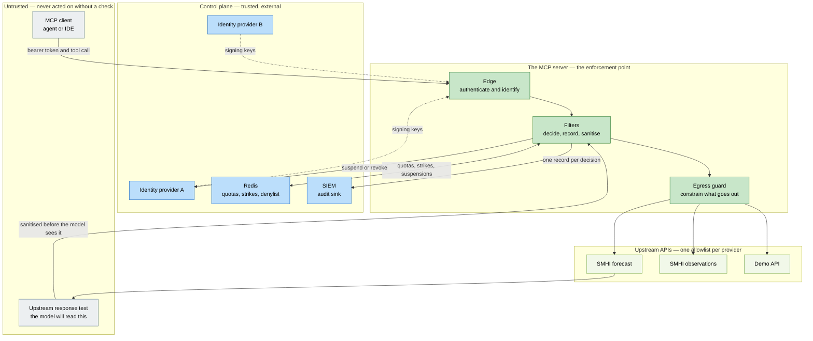

**What to notice.** The server is the only place where policy is enforced — there is no path from client to upstream that skips it. The arrow from the filters back to identity provider A is the revocation path: the server does not merely refuse a caller, it can end that caller's session at the source.

→ Roadmap §3.1

---

## 2. A call from end to end

The happy path, with each participant doing exactly one job. Nothing here is optional; a call that skips a step is a bug.

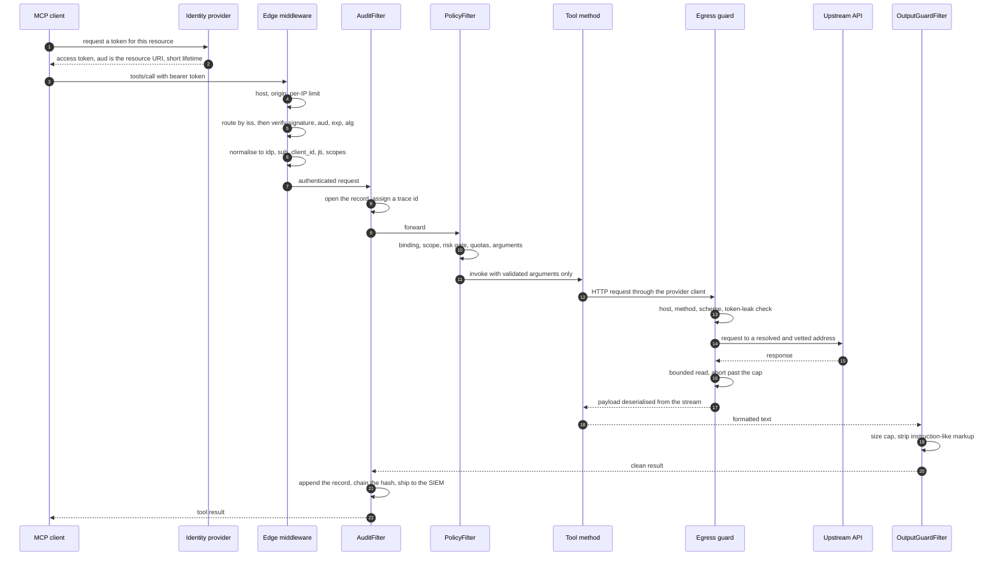

**What to notice.** The audit filter is outermost, so it brackets everything — including the refusals in the next diagram. Steps 4–6 happen before any MCP handler runs, and step 12 passes the tool *only* arguments that survived validation.

→ Roadmap §3.1, §3.5

---

## 3. Every way a call can be refused

One ladder, top to bottom, cheapest check first. Every red exit carries a distinct event name or `decision.rule`, which is what makes the audit log answerable: "why was this refused?" always has one answer.

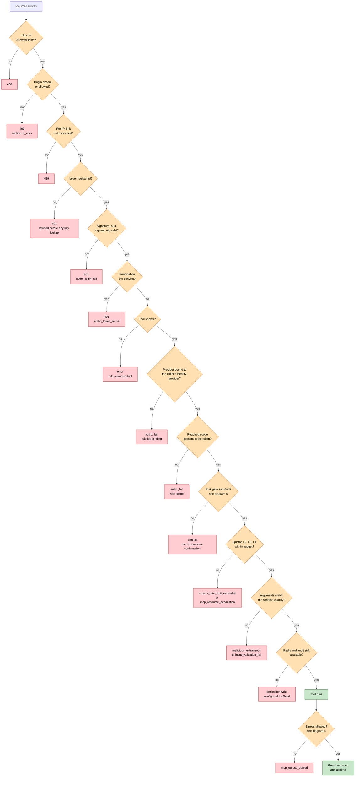

**What to notice.** The order is deliberate. Identity is established (G4–G6) before anything provider-specific is consulted, and the argument guard (G12) runs *before* the tool is invoked — a call with a bad argument never reaches the upstream at all.

→ Roadmap §3.1, §3.2, §3.7

---

> **Amended 2026-09-24 (contract-003 as built).** Before any of the refusals above, an incoming-message gate refuses any request kind the frame does not govern. The binding and scope refusals apply to resources, prompts and completions as well as tools, and a hidden item is refused in the same words as a forbidden one, so a refusal does not confirm it exists.

## 4. Routing a token to its identity provider

Several identity providers, each with its own keys and claim names. The subtle part is at the top: the `iss` claim is read **without being trusted**, purely to pick a scheme. All real validation happens after the fork.

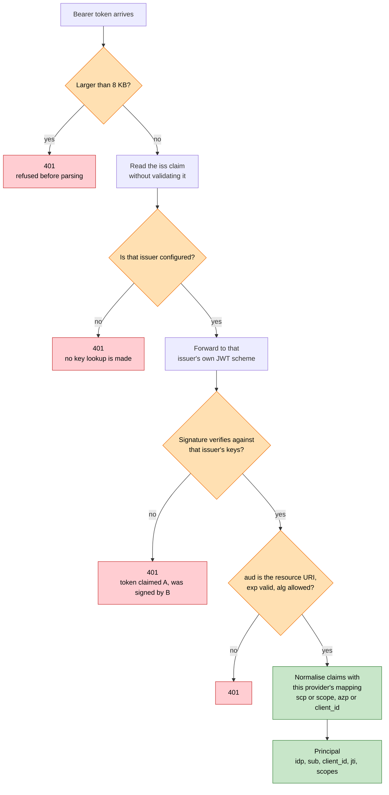

**What to notice.** Reading `iss` before validating it sounds dangerous and is not: it selects a scheme, nothing more. A token naming issuer A but signed by B dies at the signature check. And an unregistered issuer is refused *before* any network call, so an attacker cannot use a made-up issuer to make the server fetch a URL.

→ Roadmap §3.8, P1.10

---

## 5. Binding providers to identity providers

Each provider is bound to **exactly one** identity provider. Not zero, not a list. Two providers may share one.

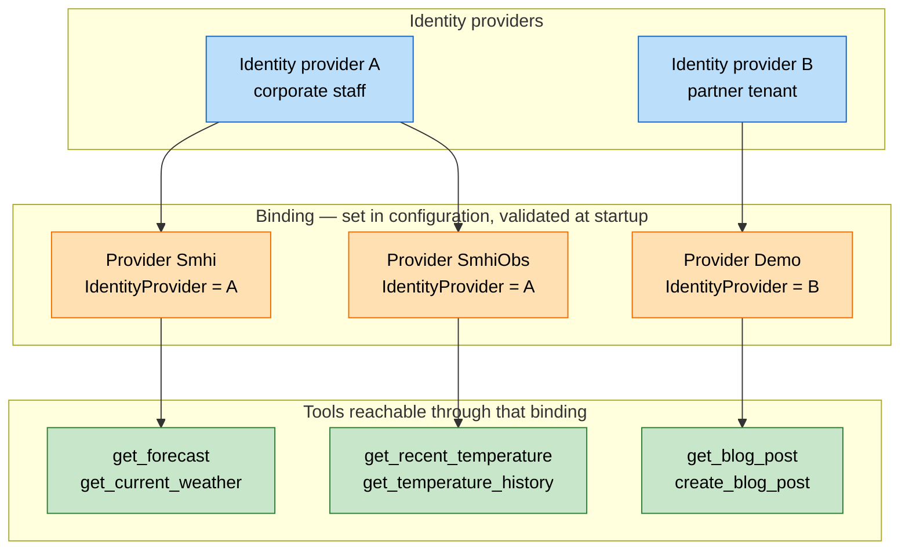

A caller authenticated by B can neither see nor call the weather tools. Visibility is filtered first, and the same rule is checked again on the call itself:

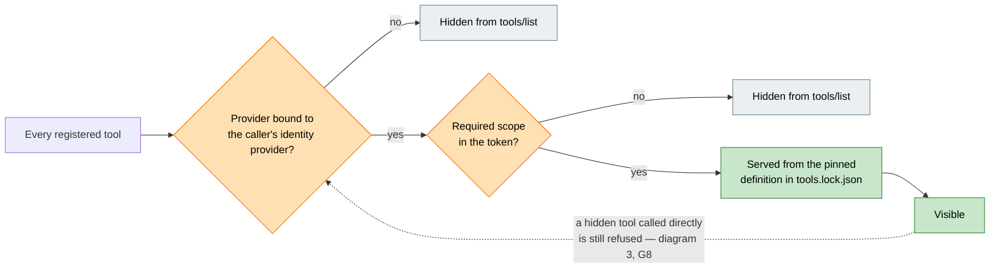

**What to notice.** Hiding a tool is a convenience, not the control. `PolicyFilter` enforces the same binding on every call, so guessing a tool name gains nothing. The dotted arrow is that second check.

→ Roadmap §3.8, I9, GOAL-06

---

## 6. Risk classes and their gates

Every tool declares a risk class. The class decides how much proof of a live, current authorisation is required — and therefore how quickly a revocation takes effect.

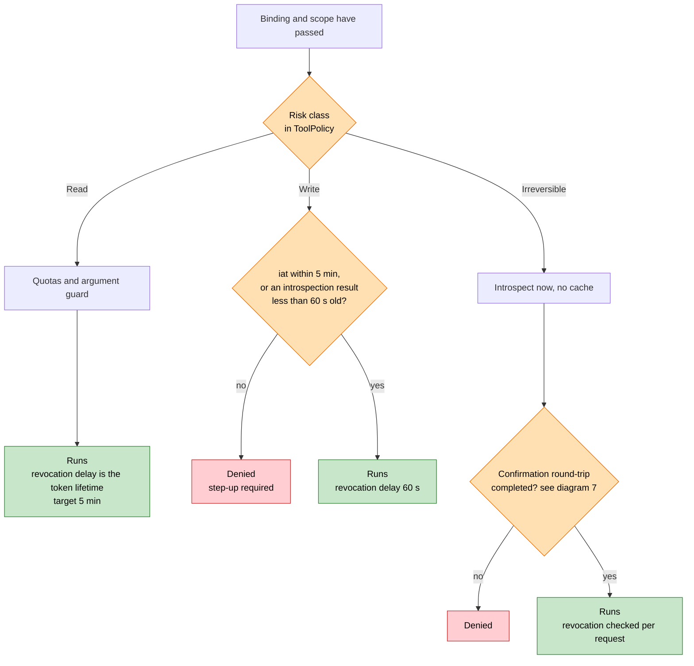

**What to notice.** A signed token cannot be recalled, so **its lifetime is the revocation delay** — that is the whole reason the three classes exist. Read tolerates a few minutes of staleness; Irreversible tolerates none and pays for it with a round-trip to the identity provider on every call.

→ Roadmap §3.3

---

## 7. Confirming an irreversible action

The server cannot force a client to show a human anything. What it *can* do is refuse to act without a confirmation it can verify — and bind that confirmation to the exact arguments, so it cannot be answered in advance.

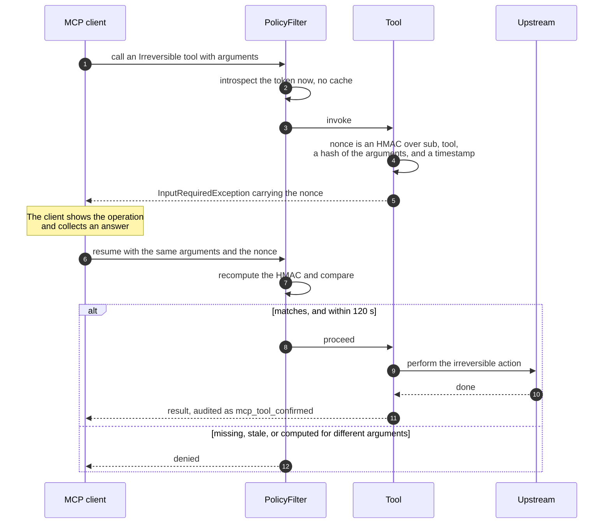

**What to notice.** The HMAC means the server stores nothing between the two halves — it recomputes and compares, which keeps the stateless model intact. Because the argument hash is inside the HMAC, a client cannot collect a confirmation for a harmless call and reuse it for a damaging one.

→ Roadmap §3.4

---

> **Amended 2026-09-24 (contract-003 as built).** A confirmation is also single-use: its id is claimed in Redis on first use, and the same confirmation presented again within its 120 seconds is refused. Without that, the stateless check above would run an irreversible tool twice on one confirmation. A client reaches the round-trip on the 2026-07-28 protocol revision, through `server/discover`.

## 8. The egress guard

Provider code never constructs an `HttpClient`; it receives one the framework built, with this handler already attached. That is what makes a provider's allowance a fact rather than a promise.

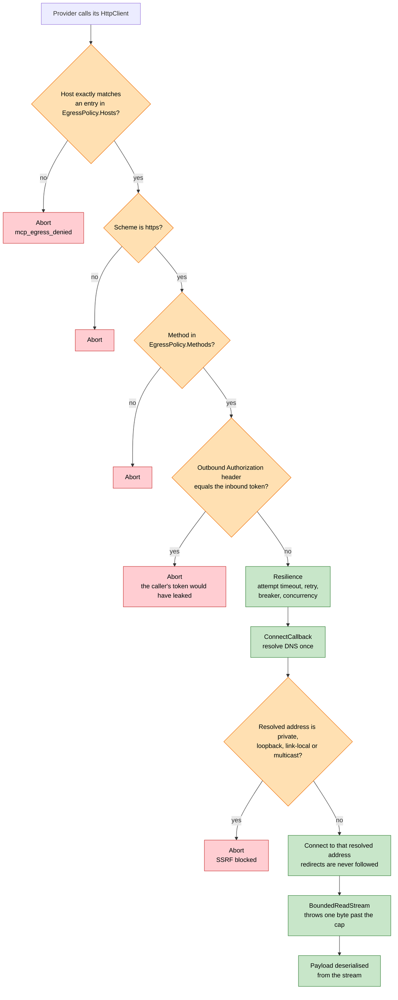

**What to notice.** Three details do real work here. Resolving DNS and connecting inside the same callback closes the gap where a name could resolve to a safe address during the check and a private one during the request. Not following redirects stops an allowlisted host from forwarding the request somewhere else. And the bounded stream aborts *while reading* — the current code buffers the whole body before checking its size, which means the cap does not actually bound memory.

→ Roadmap §3.2, P2.6–P2.8

---

## 9. The four rate-limit layers

Four limits, four different things being protected. They are not redundant.

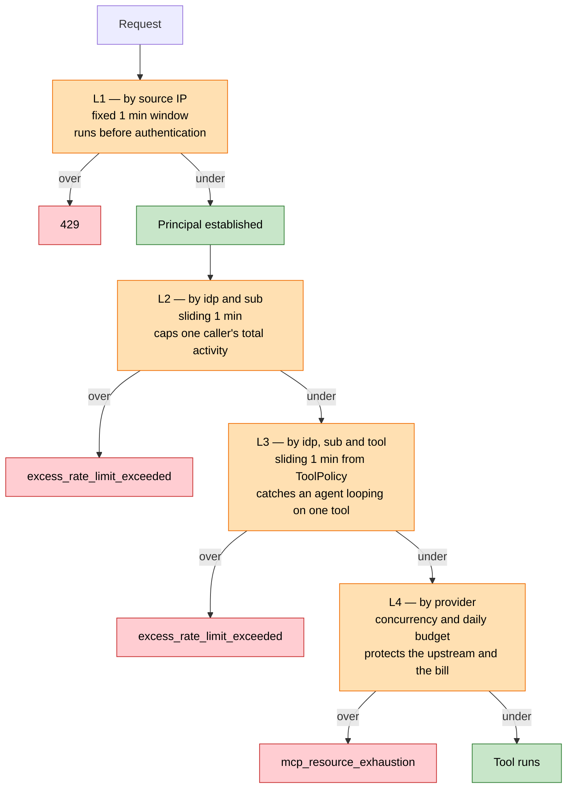

**What to notice.** L1 runs before authentication, so a flood of garbage tokens cannot exhaust signature verification. L2 to L4 are keyed on the principal and live in Redis, so they hold across instances — the current implementation keys per tool *globally*, which lets one noisy caller consume everyone else's budget.

→ Roadmap §3.6

---

> **Amended 2026-09-24 (contract-003 as built).** L2 and L3 are built, in Redis. L4 — provider concurrency and the daily budget — is built with the egress guard, in the second half of Phase 2.

## 10. The strike ladder

Violations accumulate weighted strikes in a ten-minute window, per principal. Three consequences, escalating.

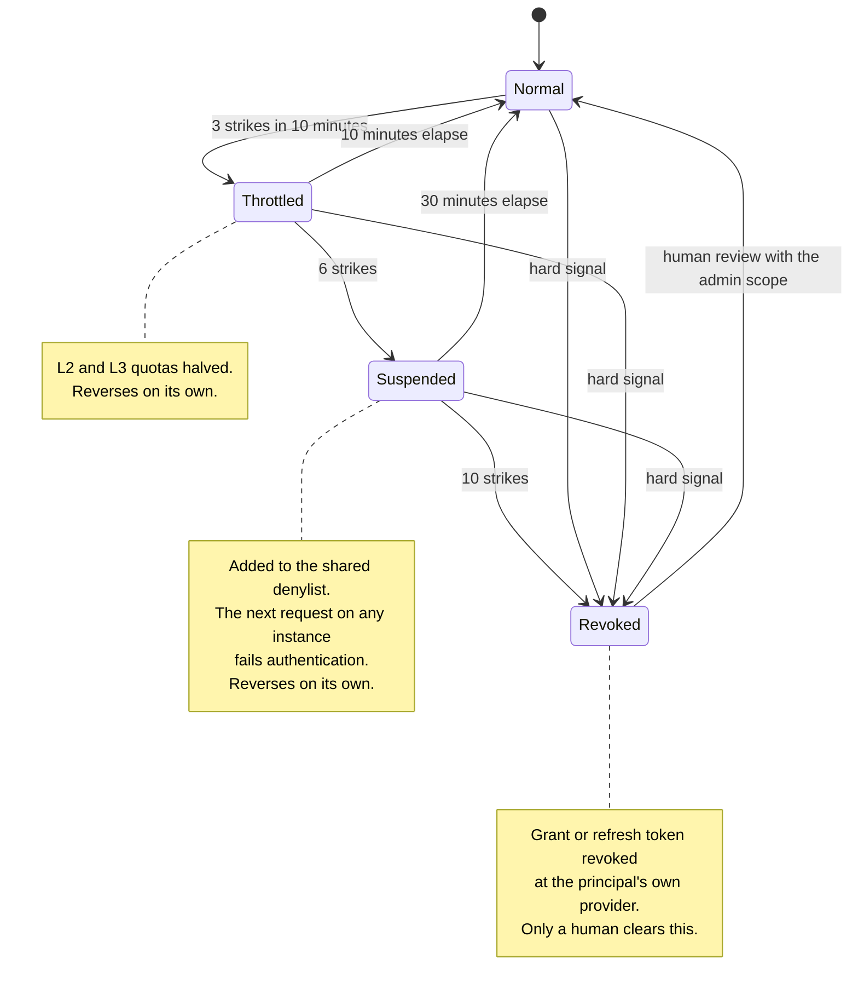

**What to notice.** Only the last step is permanent, and it needs either a hard signal — a revoked principal presenting a token again — or a person. Everything below it expires by itself. That asymmetry is deliberate: an automatic system that can permanently lock out real users will eventually do so.

→ Roadmap §3.7

---

## 11. Injection is not malice

The most important branch in the design. An agent can be steered into a violation by text the *upstream* returned. Punishing the user for that would turn any poisoned data source into a denial-of-service against legitimate callers.

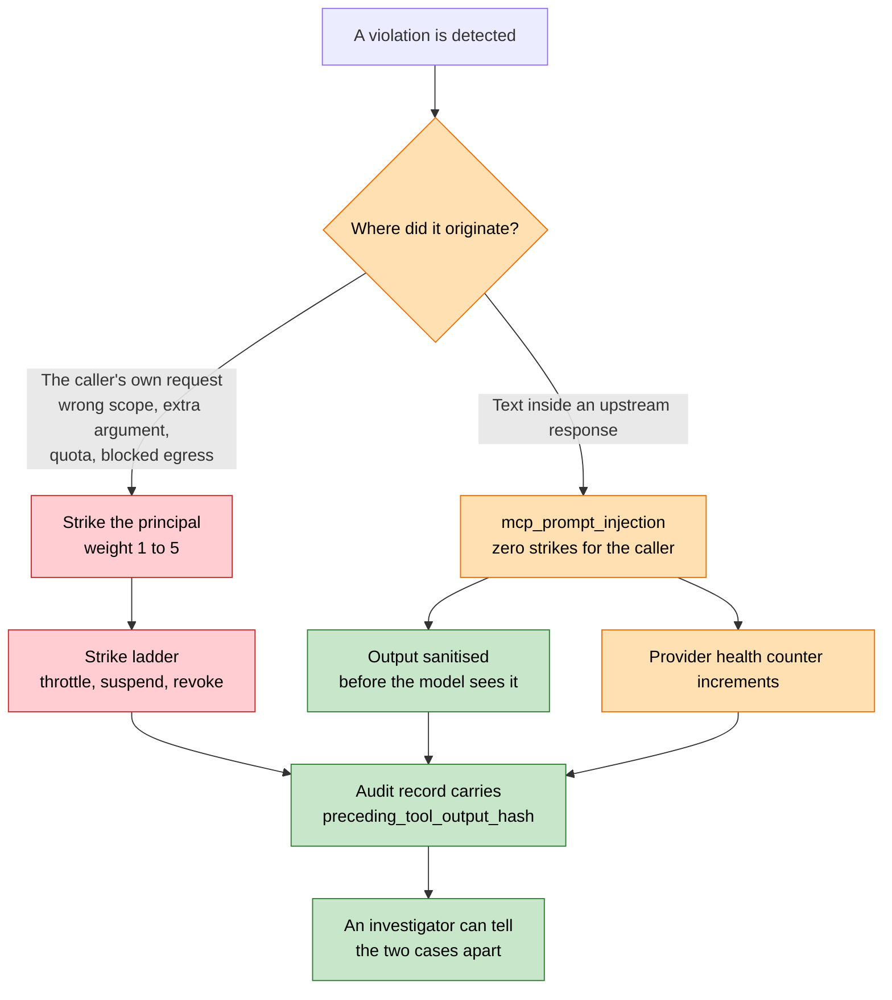

**What to notice.** The violation is still recorded either way — this is not a way of ignoring it. What changes is who bears the consequence: the caller, or the provider whose data source is producing hostile content.

→ Roadmap §3.7

---

## 12. How a revocation actually lands

Two mechanisms with very different timing, and one common mistake.

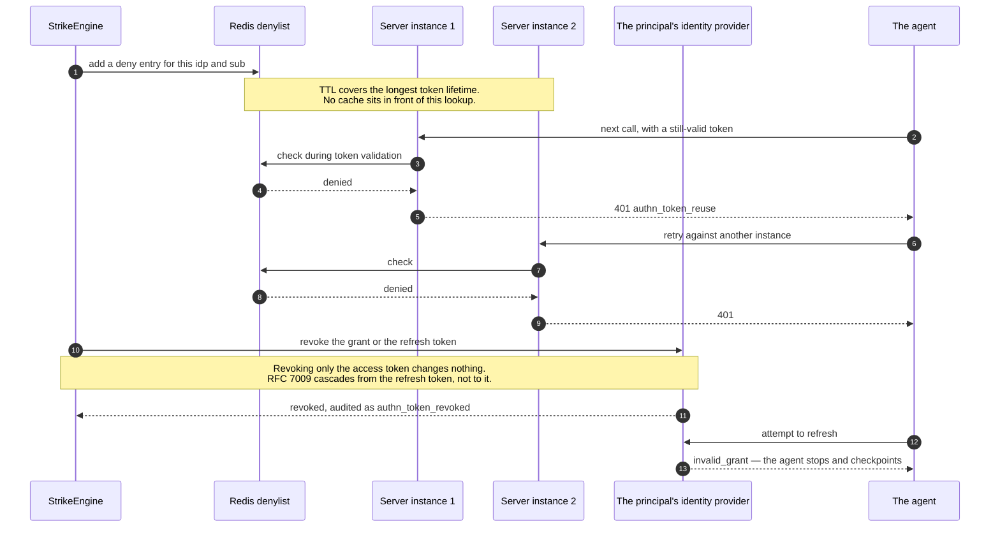

**What to notice.** The denylist is what makes suspension immediate, and it is immediate *because* nothing caches it — a sixty-second cache in front of it would simply be a sixty-second revocation delay wearing a different name. The identity-provider call is what makes revocation stick beyond this server.

→ Roadmap §3.3, P4.3–P4.4

---

## 13. Startup refuses a misconfigured server

Deny by default, enforced once at startup rather than argued about per request. Every failure exits `78` (`EX_CONFIG`) after logging `sys_startup` at CRITICAL.

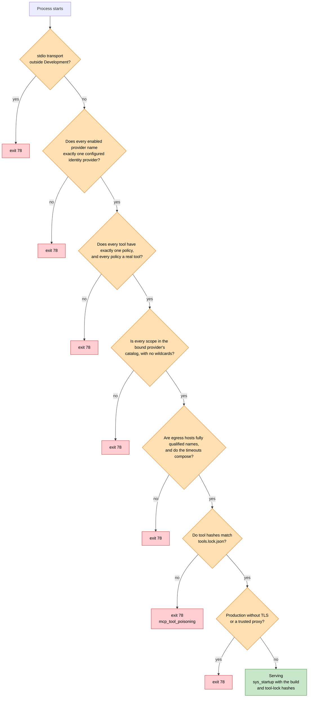

**What to notice.** A gap in configuration cannot become a gap in enforcement, because the server will not start with one. `V6` is the rug-pull check: if a tool description changed since it was reviewed, the server refuses rather than advertising it.

→ Roadmap §3.2, P5.1

---

> **Amended 2026-09-24 (contract-003 as built).** Startup also refuses: a setting in a governed section the server does not read (a typo or a retired key, named with the nearest real one); a provider that removed a registration, or registered one belonging to the frame, the SDK, the identity layer or the host; request checks installed that are not the frame's; and a primitive a module declares that the server does not serve.

## 14. What happens when a dependency is down

Fail closed, with one deliberate exception that is a configuration choice rather than an accident.

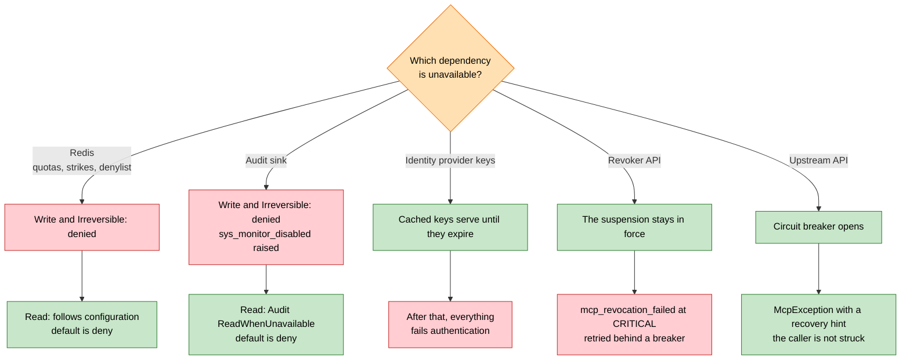

**What to notice.** If decisions cannot be recorded, decisions that change things are not made — an unaudited write is worse than a refused one. Read is the only case with a dial, and it is set to deny by default, so choosing availability over strictness has to be deliberate.

→ Roadmap §3.3, P3.6, I7

---

## 15. A decision becomes an audit record

Every allow and every deny. One record, redacted, chained, and shipped.

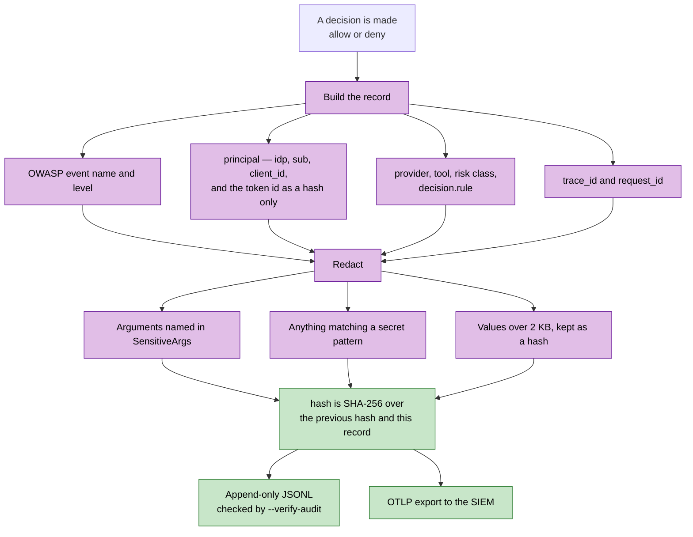

**What to notice.** The token itself never appears — only a hash of its id, which is enough to correlate and useless if the log leaks. The chain makes a deleted or edited record detectable: `--verify-audit` reports the first line where the chain breaks.

→ Roadmap §3.5, P3.1–P3.3

---

## 16. Phase dependencies

Where the work can run in parallel, and where it cannot. Identity comes before policy because policy is keyed on the principal; audit comes before guardrails because guardrails consume audit events.

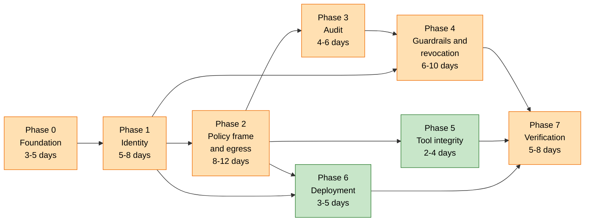

**What to notice.** Amber is the critical path; green can run alongside it. Phases 5 and 6 need only Phase 2, so a second person can take them while the audit and guardrail work proceeds.

→ Roadmap §4

---

## Where to go next

| If you want to | Read |
|----------------|------|
| The normative requirements and their IDs | [06-SECURITY-ROADMAP.md §2](06-SECURITY-ROADMAP.md#2-requirement-register) |
| What proves each control works | [06-SECURITY-ROADMAP.md §5](06-SECURITY-ROADMAP.md#5-compliance-matrix) |
| Decisions still open | [06-SECURITY-ROADMAP.md §6](06-SECURITY-ROADMAP.md#6-decisions-needed-before-phase-1) |
| How the server works today | [02-ARCHITECTURE-FLOWCHARTS.md](02-ARCHITECTURE-FLOWCHARTS.md) |
